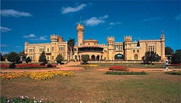

Iron Maiden has announced new tour dates for their upcoming international tour. Their new tour will take them to the palace in Bangalore, India on Saturday, March 17, marking the first time a major heavy metal band has ever toured in India.

The tour dates:

**March 2007**  
Fri 9th – Dubai Desert Rock Festival, UAE  
Sun 11th – Faliro Pavilion Arena, Athens, Greece  
Wed 14th – Belgrade, Serbia  
Sat 17th – Bangalore, Bangalore Palace, India

**June 2007**  
Wed 6th – Ostrava Banik Football Stadium, Ostrava, Czech Republic  
Fri 8th – Sudweststadion , Ludwigshafen, Germany  
Sun 10th – Download Festival , Donington Park, England  
Thu 14th – Heineken Jammin Festival, Venice, Italy  
Sat 16th – Fields of Rock Festival, Zwolle, Holland  
Sun 17th – MSV Stadium, Duisburg, Germany  
Wed 20th – Olympic Stadium, Rome, Italy  
Sat 23rd – Graspop Festival, Dessel, Belgium