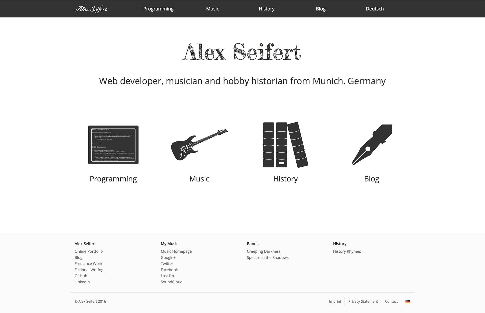

AlexSeifert.com

I’m happy to announce that my portfolio and blog have received a fresh makeover. The design is much cleaner and leaner than the last one and should load my more quickly. It is optimized for mobile devices and desktops alike and is simplified so that information is easier to find.

My design philosophy when approaching the redesign was to keep it sparse with only the more relevant content to avoid clutter. That way visitors’ time isn’t wasted with looking for information in between unnecessary design elements that only serve an ornamental purpose. This, of course, also has the benefit that it significantly speeds up loading time which is especially important for users on mobile devices.

As with the last design, the new one is responsive. Instead of creating all of the relevant CSS myself though, I implemented the [Bootstrap framework](http://getbootstrap.com/). I chose this one because it is mature, maintained and I’ve used it for several other projects in the past.

Under the new coat of paint is a whole new framework. Although the website is relatively simple, I’ve built it using the PHP-based [Symfony](http://symfony.com/) framework. The reasons for this are many. First of all, it provides a speed boost because of Symfony’s built-in caching system. It also makes it much easier to develop and maintain with the Twig template system and Symfony’s support for multiple languages. Visiting [www.alexseifert.com](https://www.alexseifert.com) or [www.alexseifert.de](https://www.alexseifert.de) takes you to exactly the same web application with exactly the same templates. The content is then rendered [based on the locale which is set by the domain in Symfony](https://blog.alexseifert.com/2016/05/06/symfony2-giving-each-locale-its-own-domain-name/).

If you have any questions, comments or feedback, please let me know either through [the contact page](https://www.alexseifert.com/contact/) or by leaving a comment on this post.

English: [www.alexseifert.com](https://www.alexseifert.com)  
German: [www.alexseifert.de](https://www.alexseifert.de)