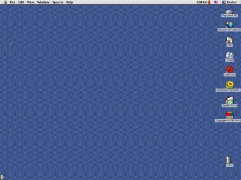

Indigo iMac G3

I just recently purchased a new iMac G3. Of course Apple hasn’t sold iMac G3s in nearly fifteen years and this one was purchased new in 2000. But that doesn’t mean it’s not new to me. The first question that I’ve been asked is why I would spend money on a computer that is fifteen years old. After all, it only has 64 MB of RAM, a 350 MHz PowerPC G3 processor, and a 10 GB hard drive. It also runs a version of Mac OS that predates protected memory on the Mac (Mac OS 9.2.2). So why did I buy it?

Well, the most obvious answer to that question is nostalgia. I’ve wanted one since they were new and can now finally afford to spend money on one (it cost me 25€). Of course that statement is all the more ridiculous when you consider the fact that I probably spent more money on the gas to go pick it up than I did on the actual machine, but that is beside the point.

Thirteen years ago, I bought an iBook G4 — not one of those iBooks that looked like a colorful toilet seat, but rather its white successor. It originally came with Mac OS X 10.1 and “Classic mode” which allowed me to boot into Mac OS 9.2.2 or run OS 9 applications in an emulated form directly from OS X. That was my first Mac and I didn’t have much software for it yet. Most of what I got at first was given to me by other people with Macs and it was mostly for OS 9. I still have almost all of this software lying around on CDs in dusty cases somewhere in the back of a closet and that is where the new iMac comes in.

While I obviously won’t be using the old iMac for every day tasks, I will use it to run some of the old games I enjoyed playing back then as well as for a couple of old language learning programs which really never go out of date since languages generally don’t change that quickly. Running OS 9 again has made me very appreciative about modern operating systems and especially about their stability, but I liked OS 9 back then and I still enjoy using it on occasion. I’m just glad I don’t have to use it every day.

Screenshot of Mac OS 9 taken by myself on an iBook when OS 9 was still new