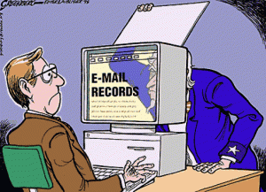
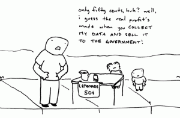

Privacy

I, like most people I know of my generation, have an extremely strong web presence. Facebook, MySpace, StudiVZ, Last.fm, WordPress.com, BlogCatalog and DeviantArt are just a few of the social networking sites that I have an account for. Of course that does not even include the other sites I have accounts for that are not technically social networking sites — websites such as Google and Amazon.com.

You have probably read it somewhere else before, but with the conveniences that these services provide comes the high price of anonymity and privacy. While some sites, such as Facebook and MySpace, are obviously much more attuned to the destruction of one’s privacy than businesses such as Amazon.com who use your personal information for business purposes (such as sending a package to your home address when you place an order), each time you sign up for a new account on a different website, a little bit more of your privacy disappears.

Unfortunately for someone of my age (a college student), having accounts on sites such as Facebook and MySpace are practically imperative for your social life. Let’s say you meet someone at a party who you would like to hang out with later or stay in contact with. The first thing they ask you isn’t for your phone number or your e-mail address, it’s whether you have a Facebook account. It’s gotten to the point that the only people you give your phone number to are your closest circle of friends. Receiving a text message is a far more private matter than receiving a message on Facebook. Why? I can’t really explain that.

Uncle Sam & Privacy

Again, the biggest problem with this is the matter of privacy. While Facebook does allow you to change your privacy settings and you yourself can control what information about yourself you post to the social networking site, you can’t control what other people put on there. For example, I have always taken the precaution of not posting pictures of myself on the site; however, I am still somehow connected to over 100 different pictures of me that have been posted by other people. Facebook even furnishes a convenient link to these pictures right on my profile page. It is virtually impossible to control this.

On a side note, some may argue that keeping a blog destroys one’s privacy. That is not true unless the blogger wishes it to be so. While with blogging people have the ability to write about their personal lives or post private pictures (and no, I’m not talking about just naughty pictures), the beauty of it is that the writer has the ability to post whatever he or she wants and therefore the freedom to disclose or conceal whatever information about themselves to the world they want to.

The biggest concern I have with these privacy matters is largely two fold. First of all, I don’t think any government agent should be able to access my private information without probable cause, which is absolutely something he or she could do if it was generically posted online. The second concern I have is that future employers will ‘research’ me on the internet. I find it absolutely absurd that potential employers could justify not hiring me just because they found out about a party I went to or what my political or religious opinions are. That to me is an enormous violation of privacy and therefore I want to reduce the risk because the sad truth is that it actually happens.

Online Privacy

In order to combat this potential problem, I have decided to attempt to reduce my web presence. This is by no means an easy task. Unfortunately in most instances, what you post on the web, stays on the web. Fortunately I have never posted anything too terribly private. I have begun by deleting my MySpace account. MySpace does not make it easy at all to cancel an account. They first make you confirm that you really want to three separate times, then they send you an e-mail with further instructions you have to follow in order to delete your account. In the e-mail you have to click a link where you are asked yet again if you really want to cancel your account. Then finally, they say your account has been ‘scheduled for cancellation’ and that it will take ‘up to 48 hours’ for the changes to take effect.

I would love to delete the other social networking accounts as well, but unfortunately it is the only way I have to contact a lot of people — especially a lot of international contacts I have. That is the hook. Once you start using the service, you’re essentially stuck if you want to keep in contact with most people.

As time goes on, I plan to systematically remove as many accounts as I possibly can. This task might sound easy, but in reality is quite difficult. Most services provide you with a way to remove your account and others just allow you to hide your account from public view, but most of these companies and websites keep your information despite requesting a deletion. We will see how many I end up actually deleting and how many I will deem necessary to keep.