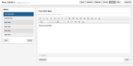

The rise of cloud computing in the past few years has raised the issue of privacy more than ever before. Companies which offer cloud computing services, such as Google, Microsoft, Apple, DropBox, Yahoo, etc, all collect large amounts of data which their users eagerly and willing share with them. Most of this data is highly private in the forms of personal and professional correspondence, pictures of ourselves, credit card and bank information, private documents, our schedules, to dos, bookmarks and browsing history, and so on. The reason people offer up this sort of information about themselves to these companies for the sake of convenience. Cloud computing platforms offer the ability to access your data from any internet-capable device (a large number of people are carrying around at least one with them all the time) and the ability to sync data between these devices.

Sharing this data with these companies, however, comes at a price. As a case study, we shall take Google as an example. Google’s privacy policy allows the company to scan through the data you share with the company in order to server you relevant ads as you browse the internet while logged into their services. By doing this, they are using your own data in order to turn a profit. There are many people who consider this a gross violation of their privacy while others find it justified since Google offers these services at no monetary cost to the user. Although I have an opinion, I am not interested in weighing into one side of the argument or the other because I can certainly see the reasoning behind both sides.

What concerns me more is the ownership of the data. Once you upload a file or send an email with a webmail service, the law is sketchy at best concerning who owns the actual data. Some companies say they own it, while other companies make it clear that the user retains ownership of it. The only way to know for sure how these companies treat the data is by thoroughly reading through their privacy policies and their terms of service which no one without a degree in law can possibly interpret.

This has lead me to embark down the path of creating a “private cloud”. Essentially, I am in the process of setting up a private server which I will then use to host my own email, calendar, to dos, files, contacts and so on. Doing this means that I will be able to guarantee that I retain all of the rights to my data. I also don’t have to worry about the above-mentioned privacy issues. Of course security will be a big concern, but I have a few methods I am going to employ to try to prevent any breaches.

First interface for my “private cloud”

To begin this project, I’ve been working on a web interface which will allow me access to webmail and all of my other text-based data on the internet. One of the nicest things about creating your own service is that you can create it exactly the way you want it. I am a huge fan of good design and I would almost rather have good design over more functionality. That means I can create an interface which suits me best. So far, I’ve created a minimalistic design which also looks quite nice in my opinion (see thumbnail). The interface will probably be refined as I continue development, but at this point it is coming along quite nicely.

My goal is to eventually release the web interface as a sort of open-source “private cloud” which people can then use on their own services in order to have web access to their server. I am aware that there are other open-source projects (such as [ownCloud](https://www.owncloud.org)) which also serve a somewhat similar purpose, but as I was interested in creating the most minimalistic, secure service possible, I decided to create my own.

Right now, the project is still in its infant state, having just begun yesterday. Most of the buttons you see in the screenshot are not functional yet, but some of them are. I am currently working on the “Notes” section because it seemed to be the most basic and I wanted to establish some sort of system to handle the data efficiently before starting some of the more complicated aspects of it such as email or the calendar. In any case though, I am excited about this project and hope it will amount to something very useful!