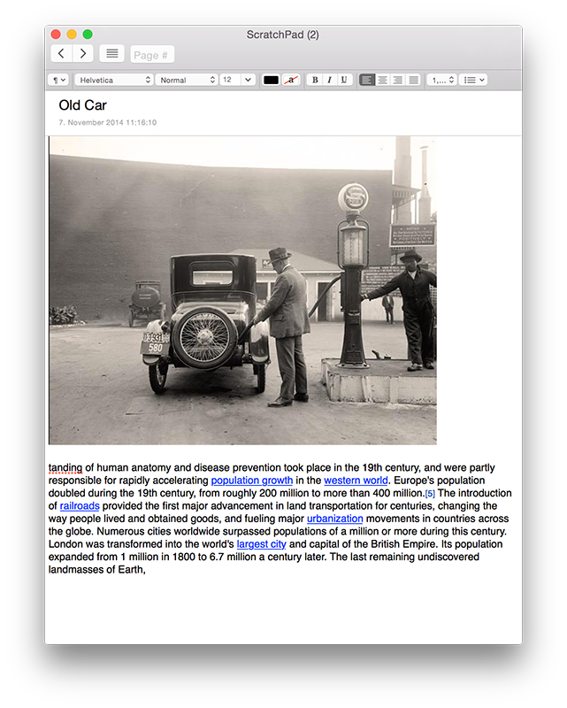

I have not reported the status of ScratchPad 2.0 in quite some time. For that I apologize, but work on it is coming along and is slowly reaching a point where testing is possible. The new version has many new improvements, is more stable and uses more up-to-date technologies from Apple. It is also 100% Yosemite compatible and also supports Retina displays. Here is a teaser screenshot:

ScratchPad 2.0

The interface may still change slightly, but that is more or less what it will look like. There are a number of new features — a couple of which can be deduced from the screenshot above, but I will wait to elaborate on those until I know exactly what will make it into the first version and what will have to wait until a future update.