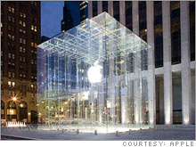
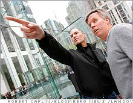

\[digg=http://www.digg.com/apple/Prototypes\_of\_Everything\]It seems that everything Apple does is very simple and intentional; a lot of thought goes into every aspect of every one of their products. I know that using prototypes is a very important aspect of making Apple products great, but what I didn’t realize was that they make prototypes of literally everything.

Even their retail stores.

Somewhere near their Cupertino campus, Apple has a warehouse in which it builds its retail store prototypes. In keeping with their minimalistic designing process, they’ve narrowed their stores down to three main materials: glass, wood, and steel.

I came across this bit of news in an article on CNN’s website: [http://money.cnn.com](http://money.cnn.com/magazines/fortune/fortune_archive/2007/03/19/8402321/index.htm).

It also mentions that Apple is now in the top ten of Fortune’s Most Admired Companies and according to [this website](http://money.cnn.com/magazines/fortune/mostadmired/2007/index.html), Apple ranks at number 7. There are more details about Apple’s ranking [here](http://money.cnn.com/galleries/2007/fortune/0703/gallery.mostadmired_top20.fortune/7.html).

