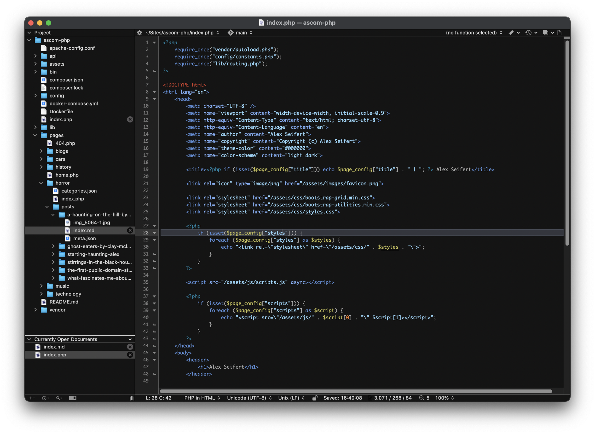

<figure><figcaption>BBEdit featuring code for a simple, frameworkless PHP version of AlexSeifert.com</figcaption></figure>

Ever since creating my first program decades ago, personal projects have always been the best place for me to try out new technologies, programming languages, frameworks, etc because there is little to no risk of something serious going wrong. If, for example, [my personal website](https://www.alexseifert.com) goes offline for a day or is unstable, it’s unlikely anyone but me will notice.

As such, practically every iteration of my personal website has been based on something different. It started with Frontpage 98/2000, then raw HTML, then ASP (pre-.NET), then ASP.NET, then PHP, then an Express-based Node.js application, then a Fastify-based Node.js application and now it’s currently a Next.js single-page application. That’s been a lot of transitions over the years, but has proven invaluable in providing a safe space to try new stuff.

My current website is about three years old and has seen some iterative design changes and framework updates throughout that time, but has otherwise remained largely unchanged. In fact, I would consider it to be positively ancient compared to how often I used to recreate the website from scratch. I’m starting to feel that itch again though, so it’s time to think about the best way to relieve that.

My first thought was to rewrite it using the Swift web framework, [Vapor](https://vapor.codes), since [I’ve been experimenting with it](https://blog.alexseifert.com/2025/06/29/experimenting-with-the-swift-web-framework-vapor/) anyway and have grown quite fond of it. I wouldn’t need any of the fancy parts such as user authentication, but it would be interesting to run my website as a natively compiled application. Particularly, it would be interesting to see if there would be a noticable speed difference either perceived or measured between it and the current Next.js application being served by an Express server with Node 22. Although if there is a difference, I suspect it would be so minute for my mostly static website that it would probably not be noticeable in reality.

However, going that route would mean maintaining and updating yet another framework that includes lots of bells and whistles that are great for complex web applications, but entirely superfluous and unnecessary for a simple, mostly static website like mine. So, I’ve decided to take a novel, yet old approach.

Website History
---------------

The very first website I created was, I think, in 1996 or 1997 and I used Microsoft Frontpage 98 since I didn’t know how to code for the web yet. I was just learning to code at all, in fact. My dad, a developer since programming meant using punch cards, encouraged me to learn how to code websites by hand using HTML. I didn’t use CSS because that specification was still in its infancy and styling was done in pure HTML. Following that, I used ASP and ASP.NET since my dad was an MS-DOS/Windows developer and therefore most familiar with Microsoft technologies.

That changed when I got my first Mac though. ASP and ASP.NET were not yet Mac-compatible and therefore I had to choose something else. I wanted to go with something more generic that would also run on Linux, so I chose PHP.

My personal website and all of my web projects were then based on PHP for years until I first started to learn Node.js in around 2016. PHP with or without frameworks became the basis for my “[boring stack](https://blog.alexseifert.com/2024/02/05/the-boring-stack/)“. As such, despite all of the transitions between technologies, my website was based on PHP for most of its life. I used it with custom code as well as with frameworks such as [Symfony](https://symfony.com) which was a favorite of mine for quite some time.

Are you serious?
----------------

Yes, I am. As you may have guessed by now, I’ve decided to bring back good ol’ PHP for my personal website. You might wonder why PHP of all things. Why now in 2025? Well, the reason is straightforward: PHP allows me to easily create a simple website without complex frameworks, hundreds of megabytes of dependencies (I’m looking at you `node_modules`!), a lengthy build process, version compatibility issues, and generally a ton of bloat I don’t need for my website.

Apache will take care of the server aspect which I’m running anyway and would use as a reverse proxy for a Node or Swift-based application. Also, updates are taken care of by the package manager which means I don’t have to worry about incompatibilities. Sure, I could install extra stuff with [composer](https://getcomposer.org/) if I want, say, a package to parse Markdown, but I don’t *have* to install any such dependencies and probably won’t because I don’t need them.

Another benefit is that I don’t have to worry about process management through systemd. Apache is always automatically started and configured if the server has to restart and that’s all that I have to worry about. A Node-based application would require its own systemd process and configuration to ensure it runs properly and reliably. I’ve done it before and it’s not by any means difficult, but it’s just another cog in the works that needs maintaining.

Essentially, it all boils down to simplicity. The less there is, the less that needs to be maintained, fixed, debugged, etc. Frankly, I’m tired of having to relearn the entire paradigm of a framework with each new major version. (You can’t see it, but I’m giving Next.js and their ridiculous [app router](https://nextjs.org/docs/app) the evil eye here.) That might be worth it for large, complex applications where frameworks mean developers don’t have to write a lot of common functionality, but I don’t need it for my small, personal website.

How am I building my PHP application?
-------------------------------------

This is where things get interesting. PHP, like other languages, has a plethora of frameworks to choose from, but I’m not going to use any of them. I’m doing it all with as few external dependencies as possible.

### Routing

I do, however, want clean URLs for my website which means instead of seeing `/music.php` at the end of the URL, users will just see `/music`. PHP frameworks all include routers for exactly this purpose, but I decided to write my own since I don’t need advanced features such as middleware or parameter parsing.

The code for my custom router is 54 lines and works together with an Apache `.htaccess` file. Without the `.htaccess` file, the URL would look like `/index.php/music`, but Apache hides the `/index.php` section from the user while still loading that particular file. This is nothing new in the PHP world and is used on most PHP-based websites, including this WordPress-based blog.

From there, my custom router looks into a directory called `pages` which is located at the root of the project for the equivalent of the path plus `index.php`. If that doesn’t exist, then it looks for the path plus the last part plus `.php`. So, `/music` would first look for `/pages/music/index.php`. If it doesn’t find that, it looks for `/pages/music.php`. If it doesn’t find that path, then it returns a 404 page.

The router then includes whichever file it found in the body of the `index.php` file that forms the base of the website. Meta data such as the page title is stored in a PHP dictionary array with they key being the path of the page. The `index.php` file gets the meta data from there based on the path and displays it accordingly.

That’s all there is to my custom router. Again, I don’t need anything fancy like dynamic parameters that could be included in the URL or any middleware. I just need static paths and that’s what my router does perfectly well without any external dependencies.

### Database Caching

Other than the router, I use an sqlite database as a cache for the [blogs page](https://www.alexseifert.com/blogs/). I need a cache here because the page includes the latest entries from several different blogs and loading them on demand would be too slow. As such, I have a PHP script that runs via a cron job that fetches the title, URL of the featured image, excerpt and URL of the newest six posts from each blog and stores them in the sqlite database. The blogs page then fetches this meta data from the database and displays it.

You might think be thinking, “Oh, so he does need an ORM!” Nope, no ORM. Instead, I’m committing the mortal sin of using raw SQL along with PHP’s built-in support for sqlite. That does mean I rely on the `pdo_sqlite` PHP extension, but again, installation and updates are handled by the operating system’s package manager, so I don’t have to worry about it.

### The Frontend

Other than that, there is nothing fancy. It’s all just pure HTML, PHP, JavaScript and CSS. I’ve decided to forego SASS which I usually use for my projects and write pure CSS. Since SASS was introduced, CSS has come a long way with native support for variables, class-nesting and more. I don’t want to install Node on my server and rely on the Node `sass` package just to build SASS, so pure CSS it is. Again, no dependencies where they are not absolutely needed.

In terms of JavaScript, I’m going to keep it very minimal. The Next.js-based version that is currently live has *megabytes* worth of JavaScript since it is a single-page application and I really just don’t need that for my mostly static website. In fact, the only JavaScript I may include is the snippet for my self-hosted instance of [Matomo](https://matomo.org/). We’ll see though.

Conclusion
----------

So, why did I decide to rewrite my personal website like it’s 2005? As mentioned above, simplicity and speed. Less dependencies means less complexity which means less time spent on it. Writing pieces of it like the router myself means that once it works the way I want it, I can forget about it. I don’t have to update it, I don’t have to worry about rewriting portions of my application just because a framework’s paradigm has changed, I don’t have to worry about version conflicts, etc. I can put my website up on my server and forget about it until I want to change it again.

The inspiration for this idea was partially the idiotic new [app router in Next.js](https://nextjs.org/docs/app), but also the [smolweb](https://smolweb.org/) movement. I’ve really grown to like the idea of only including the absolute minimum of what you need for a website. As such, the design will be fairly basic, but I think basic can also be elegant and that is exactly what I’m going for. My current design has lots of animations and other eye-candy, but I’m going to forego all of that in favor of simple elegance and efficiency.

Some people out there might be wondering why I’m not using a static site generator such as [Hugo](https://gohugo.io/) that would allow me to have a bundle of plain HTML, CSS and JavaScript files to serve statically without the need for any sort of interpretation on the part of the server. Admittedly, the idea does appeal to me and I have even dabbled in making my own static site generator. However, it adds another layer of complexity with a whole slew of dependencies to generate the site in the first place. Plus, PHP is so ridiculously fast for the basic website I’m going for that the difference between it and static HTML pages will be negligible and unnoticeable for users.

Another consideration was to just simply use this very WordPress instance since I’m going to continue to use it for my blog anyway. I could just expand my custom theme with custom page templates for the various pages of my portfolio which would allow me to have full control of the design of the pages without having to use WordPress’s block editor. The block editor works fine for writing blog posts, but is miserable for creating pages that don’t look like blog posts. By doing that, I would have one *less* application to worry about. I still haven’t fully ruled that out as a possibility, but I do like the idea of having my portfolio separate, so I may just stick with my custom PHP application for it.

The new website is still a work-in-progress and can’t be viewed publicly yet. In fact, it doesn’t even really have a design yet. I’ve been getting the router and the caching working, but now that they are stable, I’m going to focus on design and content. I have no idea when I’ll be done with it, but I will write about it here when I am.

So far, the experiment has been incredibly relaxing and fun in a way that managing a multitude of dependencies is not. It’s nice to have the freedom that not using a framework gives you. It’s also somehow ridiculously satisfying to consciously and rebelliously use bad practices like global variables and raw SQL directly in the PHP page templates. I wouldn’t recommend that for most applications, but in this particular case, I don’t care. I’m avoiding additional complexity because it isn’t needed here.

Also, I included a screenshot of BBEdit displaying an experimental version of this project that included support for Markdown files above. For nostalgia’s sake, I’m writing it all using BBEdit which I used to use as my primary editor many moons ago. Anymore, I use Visual Studio Code, but since none of the features I use most of the time work for PHP (i.e. CMD+click to jump to definitions), I decided to go fully on board with doing it the good ol’ fashioned way.

*It would be interesting to hear what you think of my approach here. What do you think about the idea of minimizing dependencies and complexity to only include the bare necessities for the specific project? Would you have done it differently? Would you have chosen a different technology stack? If so, let me know how and what you would have chosen! I would interest me greatly!*