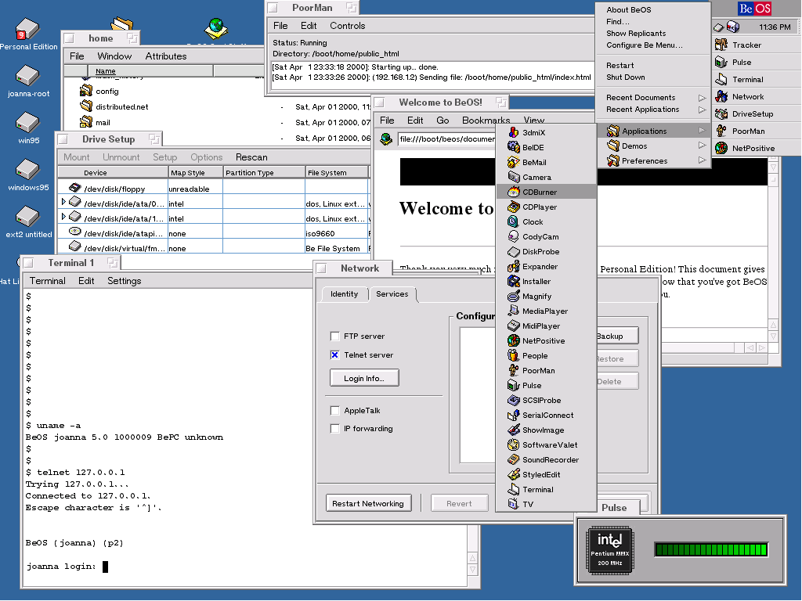
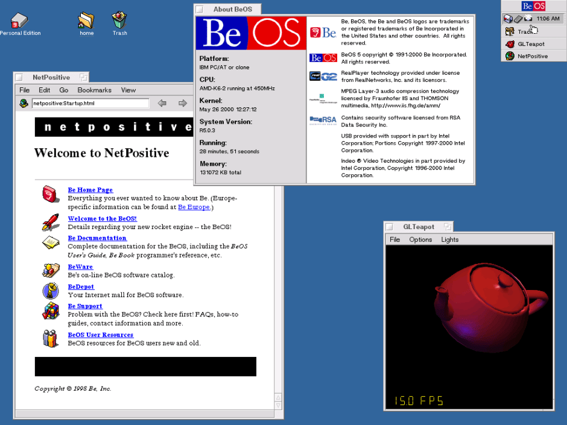
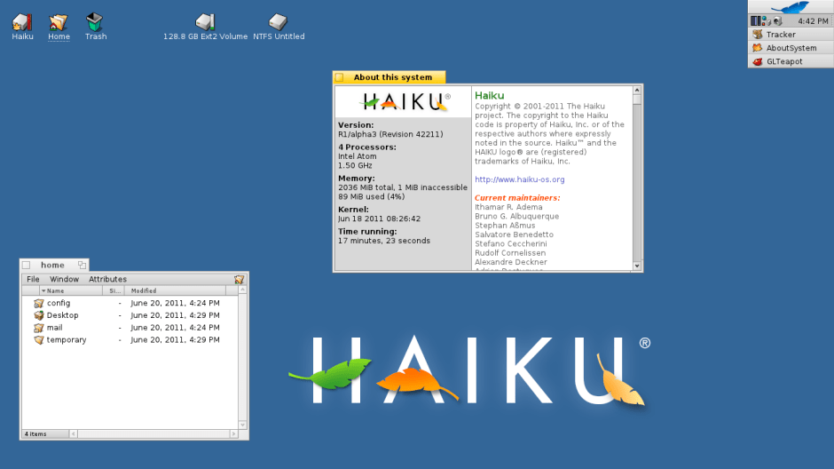

<figure><figcaption>BeOS</figcaption></figure>

In 1991, a company called Be Inc. began development on an operating system it called BeOS. It was independent from the larger computer companies such as Apple and Microsoft, but was not a flavor of Linux which was still just in its infancy.

Technically, it was way ahead of its time supporting more modern hardware and using it more efficiently. Its interface was also significantly different from its competition as it was designed on the principle of ease-of-use, clarity and with an attention to detail. Having been conceptualized for digital media work and to take advantage of the latest hardware, it was graphically a far more capable system than either MacOS 7 (or System 7 as it was known then) or Windows 3.1.

What is BeOS?
-------------

BeOS was originally written to run on the Be’s [BeBox](https://en.wikipedia.org/wiki/BeBox) hardware. For its time, it was an especially modern operating system that included features such as preemptive multitasking, pervasive multithreading and symmetric multiprocessing — none of which MacOS or Windows had yet.

The OS was also partially POSIX compatible, although not actually derived from Unix. Nonetheless, a command-line interface was provided through Bash. Its API was written in the familiar language of C++ so that developers could easily write applications for it.

One other aspect that was ahead of its time was that the entire GUI included Unicode as its default encoding. This meant it supported a large range of languages and character right out of the box, including those that don’t use a Latin-based alphabet.

Background and Development
--------------------------

The first versions of the operating system were written to run on the [AT&T Hobbit](https://en.wikipedia.org/wiki/AT%26T_Hobbit)\-based hardware that the BeBox was built upon. Support for the PowerPC architecture came soon afterwards with the hope that Apple would purchase it as a replacement for MacOS which was showing its age.

That never came to fruition, however, as Be CEO Jean-Louis Gassée wanted more money for it than Apple was willing to pay. The exact amounts are difficult to determine as every source gives a different value, but it is safe to say that Apple was only willing to pay roughly half of the asking price.

In March 1998, BeOS was ported to the Intel x86 platform with its R3 release. The idea was to make the OS compatible with common hardware configurations that Windows users were already using in order to spur more interest in the platform.

Eventually, a less feature-rich version of the OS was released for free in March 2000 with the R5 release which was also known as BeOS Personal Edition. It could easily be installed alongside Windows or Linux and was supposed to drum up more developer interest in the operating system.

<figure><figcaption>BeOS in action with a browser open</figcaption></figure>

What happened to it?
--------------------

By the time BeOS was ported to Intel hardware, Be Inc. was suffering financially. They were deep in debt and their strategy of selling both hardware and software as a package like Apple had failed. Their attempts at saving the operating system by making it more widely-available never panned out.

Developers were not interested because there weren’t enough users and users weren’t interested because there either wasn’t enough software or because they had never heard of it — the fatal trap that new platforms so easily fall into.

In 2001, Be was sold to Palm, Inc for about $11 million which was roughly a tenth of what Apple had been willing to pay several years before. This marked the death of the company as well as the operating system. The R5 release was the last official version.

BeOS Now
--------

Despite the platform never reaching widespread support, it did garner a small, but devoted fanbase. Several of these fans kept the idea of BeOS alive in one form or another for several years afterwards. These clones came in the form of Linux-based varieties as well as completely new implementations. Some just reproduced the GUI on an entirely different platform while others tried to be binary-compatible.

The only modern variant that is still currently in development is [Haiku](https://www.haiku-os.org/). It is a complete reimplementation that is directly compatible with BeOS applications and runs on modern hardware. It is also free and open source.

For anyone who is interested in trying this forgotten operating system, it is the perfect way to do so. The Haiku project even provides [guides for setting up Haiku in a virtual machine](https://www.haiku-os.org/guides/virtualizing).

<figure><figcaption>Haiku – A modern reincarnation of BeOS</figcaption></figure>

Conclusion
----------

The reason I decided to write about BeOS as the first article written on Developer’s Notebook about retro software is because I remember using it when the free version came out in 2000. I installed it alongside of Windows 2000 and remember enjoying the experience. In fact, I used it for about a year instead of Windows for most things, although I was never able to get rid of Windows entirely due to the lack of specific software I needed.

When development of BeOS ceased, I was disappointed. I would not consider myself to be one of the OS’s hardcore fans, but I would have preferred to stay with it for longer than just a year.

When the Haiku project began, I was excited about it, but development is slow due to lack of funding and it primarily just being developed by hobbyists. Twenty years after Be was sold to Palm, the system also looks a bit dated, although it is still fun to run in a virtual machine from time to time to indulge in a bit of nostalgia.

At the beginning, BeOS was ahead of its time, but as Microsoft, Apple and Linux caught up, it became increasingly more irrelevant. Developers stayed on the platforms that were more widespread and eventually BeOS faded into the background almost entirely.

*Have you ever heard of or used BeOS? If so, what were your experiences with it? Let use know in the comments below!*

*If you would like to see Haiku in action without actually installing anything, the following video is a great demonstration of it:*

<figure>
<iframe loading="lazy" class="youtube-player" width="640" height="360" src="https://www.youtube.com/embed/hQyMS5q5H5s?version=3&amp;rel=1&amp;showsearch=0&amp;showinfo=1&amp;iv_load_policy=1&amp;fs=1&amp;hl=en-US&amp;autohide=2&amp;wmode=transparent" allowfullscreen="true" style="border:0;" sandbox="allow-scripts allow-same-origin allow-popups allow-presentation allow-popups-to-escape-sandbox"></iframe>
<figcaption>A look at <a href="https://www.haiku-os.org/" target="_blank" rel="noreferrer noopener">Haiku</a>.</figcaption></figure>

*This article originally appeared on [Developer’s Notebook](https://www.developers-notebook.com/retro-software/retro-software-beos/).*