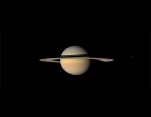

Saturn

As I mentioned in my last post, tonight I went back to the university and we observed the night sky. We had a few clouds that were kind of obnoxious, but generally it wasn’t too bad. We looked at the moon and several of the constellations through strong binoculars. We also looked at Saturn, a comet and several nebulae. Eventually, our astronomy teacher decided to get out one of their telescopes and we looked at the Orion Nebula and Saturn through that. It was really spectacular.

Through the telescope, you could see some of the stars in the Orion Nebula and you could clearly see the gases around the newly forming stars. When we looked at Saturn, you could see its moons as well as its rings very clearly. Unfortunately Saturn was a such an angle that it’s rings were flat, so we couldn’t see any details of the rings, but it was still quite amazing to see. It looked kind of like the picture to the right, except it wasn’t obviously an artistic rendition of it and Titan was on the left of the planet, not the right as shown in the picture. I think I’ve seen Saturn before through a powerful telescope in high school, but I don’t remember it looking like that. They probably didn’t have as strong of a telescope as the university here does.

We’re going to have another night like this in a few weeks and hopefully the weather will be warmer and the skies clearer. Maybe then we’ll be able to see some really interesting things in the night sky that we missed tonight because of the clouds.