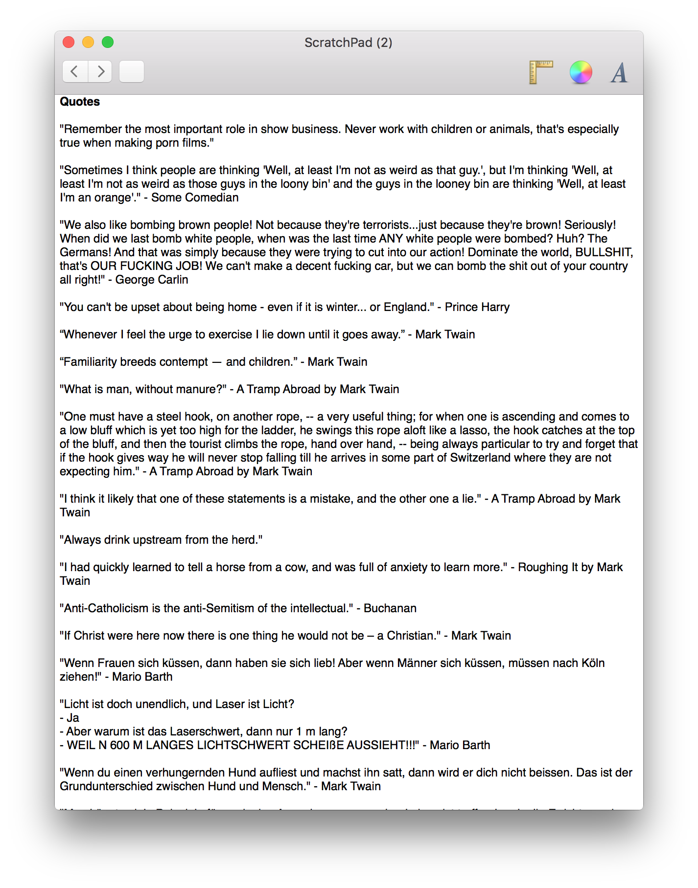

ScratchPad 1.4.1

Today I’m happy to announce the first new release of ScratchPad in four years. It is a very small update that gets rid of the old pre-Yosemite style buttons and replaces them with modern OS X elements (see the screenshot). It also adds support for Retina displays. This should ensure that ScratchPad continues to look up-to-date even if Apple changes its UI again.

You can update by either clicking “Check for Updates” in the “ScratchPad” menu in the menubar or by [downloading the new version directly](https://github.com/eiskalteschatten/ScratchPad/releases/download/1.4.1/ScratchPad.zip).

Version 1.4.1 is just an interim release until ScratchPad 2.0 is finished. It is still under development and I work on it when I can, but it is difficult to find the time with all of the other projects I also have going on at the moment.

You can find more information about the application on [ScratchPad’s website](https://www.alexseifert.com/scratchpad/) as well as the source code on [GitHub](https://github.com/eiskalteschatten/ScratchPad).

If you would like to leave feedback or report a bug, please [contact me](https://www.alexseifert.com/contact/).

**Release Notes**

-   \[Updated\] Updated back & forward buttons to use OS X’s native buttons.
-   \[Updated\] Added Retina-compatible icons.