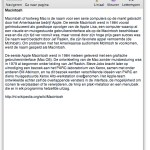

ScratchPad 1.2.3 has been released! Included in the new version:

-   **\[Changed\]** Moved ‘Delete Page’ menu item to the File menu.
-   **\[International\]** Dutch localization added.

You can download either by selecting “Check for Updates” in the application menu or by downloading it [here](http://scratchpad.alexseifert.com/ScratchPad_1.2.3.dmg).

