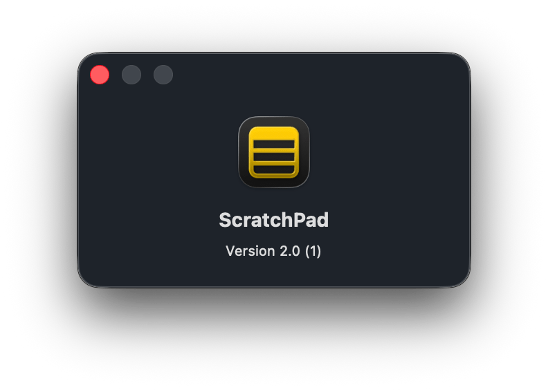
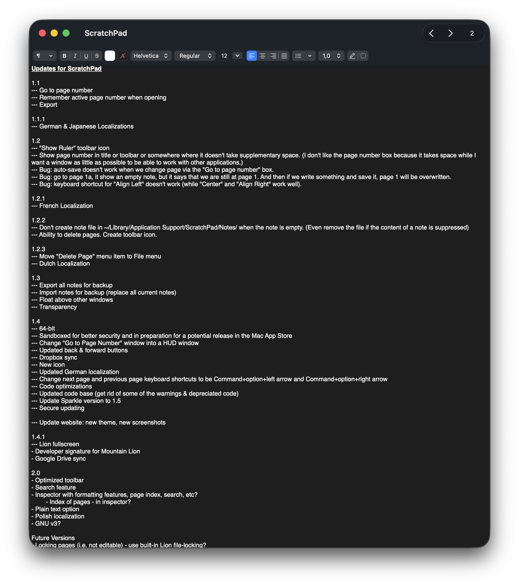
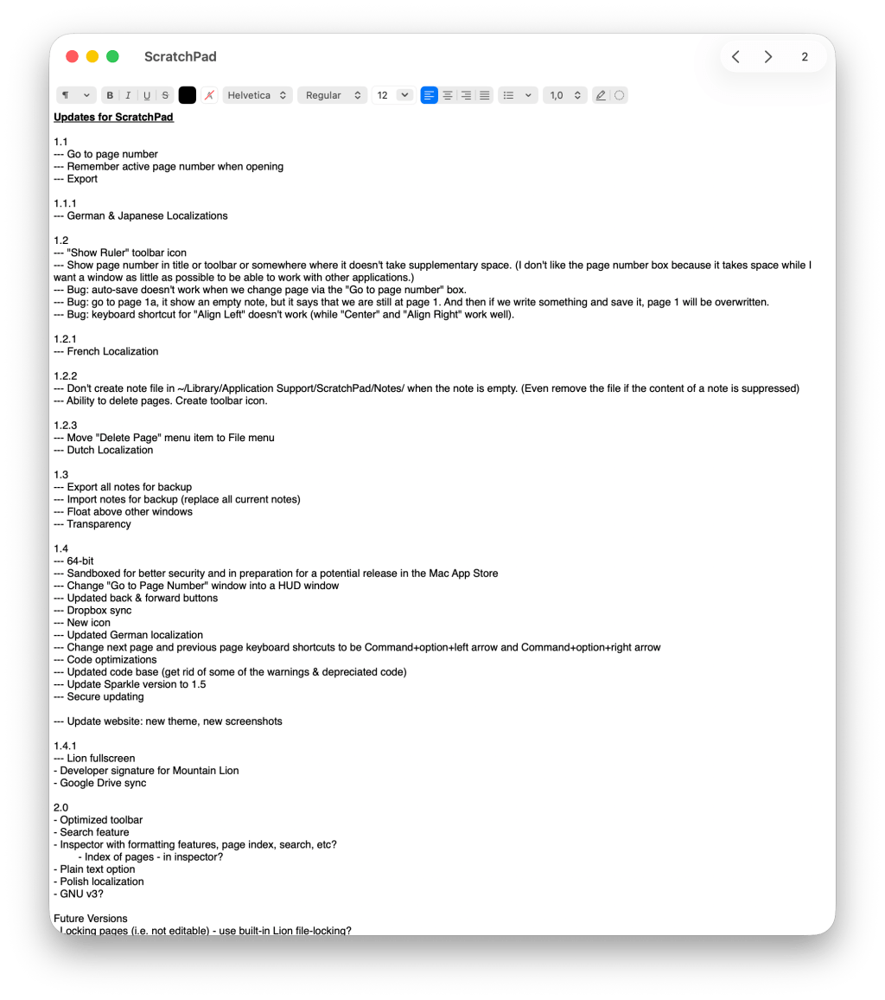
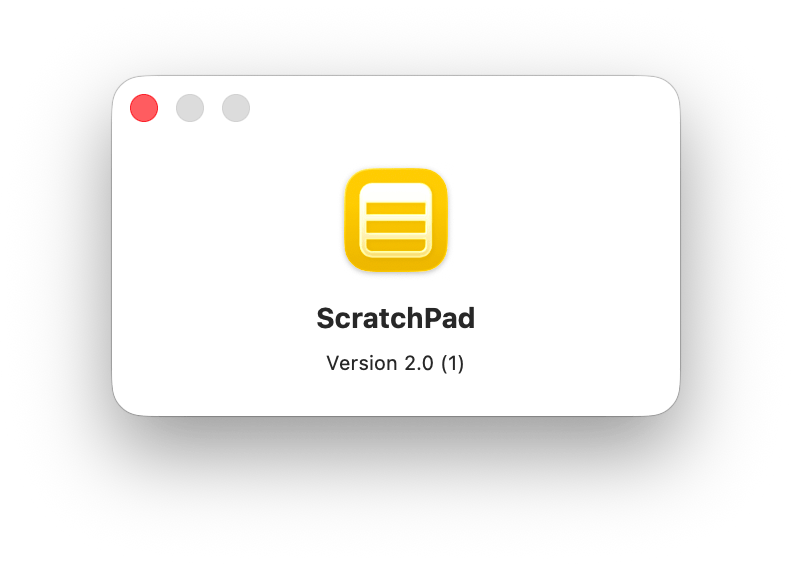

<figure></figure>

I have some unbelievable news for anyone who has used my basic note-taking program for Mac called ScratchPad. I have a more or less final build of version 2.0. The last time I attempted a version 2.0 of ScratchPad was over ten years ago. You can see my post about it from 2014 on my blog [here](https://blog.alexseifert.com/2014/11/08/progress-on-scratchpad-2-0/).

The only question yet to clarify is whether I’m going to distribute it online or via the App Store. I’m thinking the App Store because then I don’t have to worry about implementing an update mechanism with [Sparkle](https://sparkle-project.org) as is the case for the current version.

[I released the original ScratchPad 1.0 in 2008](https://blog.alexseifert.com/2008/02/16/scratchpad/) for Mac OS X Tiger. At the time, I wrote it using Objective C. ScratchPad 2.0 is a complete rewrite from the ground up using Swift and SwiftUI. You can have both ScratchPad 1.0 and 2.0 installed at the same time and you can also import notes from 1.0 into 2.0, although due to Apple’s sandbox policies, you have to do it manually. I made it as easy as possible and there are in-app instructions on how to do it. It’s a non-destructive import which means your old notes are only copied and not moved so there is no risk of data loss.

In any case, here are some screenshots to prove it’s actually real:

<figure></figure>

<figure></figure>

<figure></figure>

It has exactly the same capabilities as the old ScratchPad using macOS’s built-in rich text editor. However, since I am using modern SwiftUI with Liquid Glass, it does require macOS 26 Tahoe. Older versions of macOS aren’t supported. It will be a universal application that will support both Intel and Apple Silicon Macs.

Also, I now belong to the Apple Developer Program which means that, unlike ScratchPad 1.0, the new version will be certified and can run without any tricks. That is also why I’m considering using the App Store to distribute it.

I’m planning on testing thoroughly over the weekend and will hopefully be able to fully release it next week.

As with ScratchPad 1.0, the new version is also open source. You can view the source code on GitHub:

-   2.0: [https://github.com/eiskalteschatten/ScratchPad](https://github.com/eiskalteschatten/ScratchPad)
-   1.0: [https://github.com/eiskalteschatten/ScratchPad-v1](https://github.com/eiskalteschatten/ScratchPad-v1)