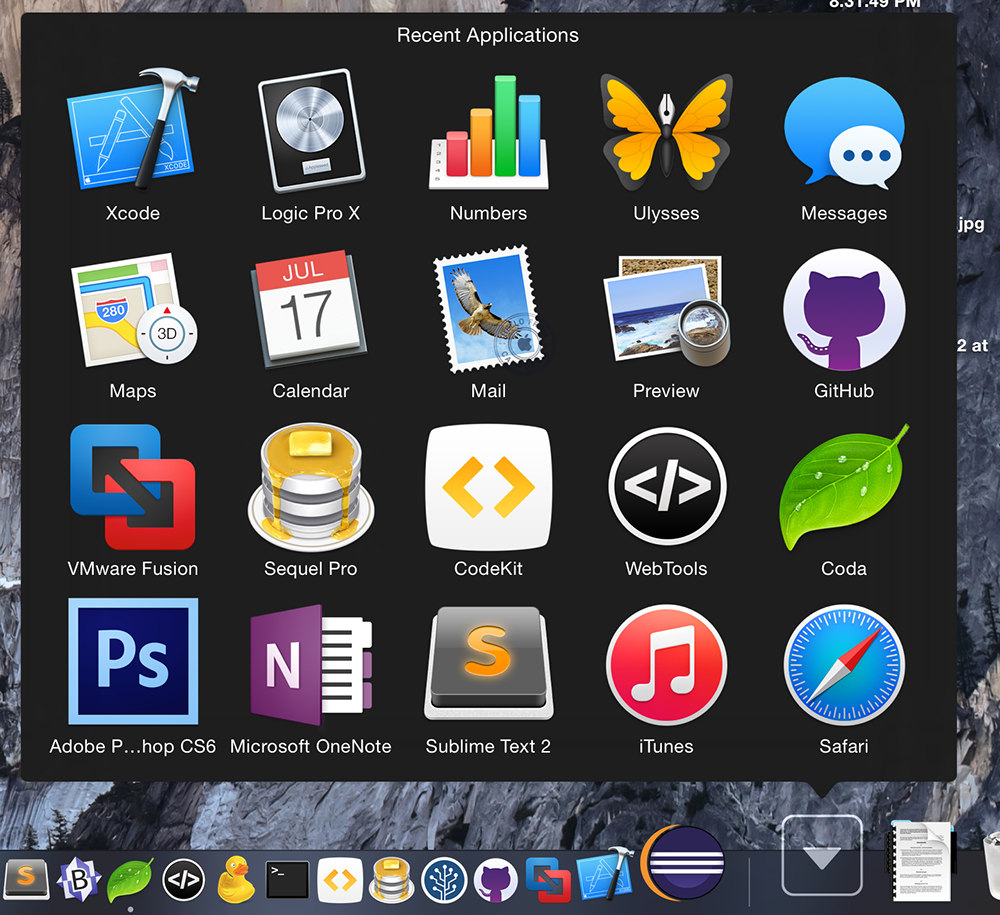

Recent Applications

There is a little-known trick I have used for years in OS X which lets you display your most recently opened applications in a Stack in the Dock next to the Trash. This is an integral part of my workflow in OS X because it is far more convenient than having to go up to the Apple menu and then down to Recent Items and over to the application you want to reopen. It also sorts the applications by time rather than by name so that the most recently opened show up first on top. I find this to be a lot more useful.

In order to add this Stack to your Dock, you will have to be somewhat comfortable with the Terminal as Apple hasn’t made it a feature that is available in the Settings app. Fortunately, it’s easy to do — just enter the following commands:

`defaults write com.apple.dock persistent-others -array-add '{ “tile-data” = { “list-type” = 1; }; “tile-type” = “recents-tile”; }'`

followed by

`killall Dock`

Your Dock will then disappear and in a couple of seconds reappear with the next Stack next to your Trash and Downloads folder. Just like any other Stack, you can change the way it displays the icons by right-clicking on it and you can move it around on the left side of the Dock. It won’t be filled right away, however, so open and watch the list grow. It displays a maximum of sixteen recent applications by default. There may be a way to change that, but I haven’t found one yet. If you decide you don’t like it, then just drag the Stack off the Dock and let go just like any other icon.

Recent Applications Opened