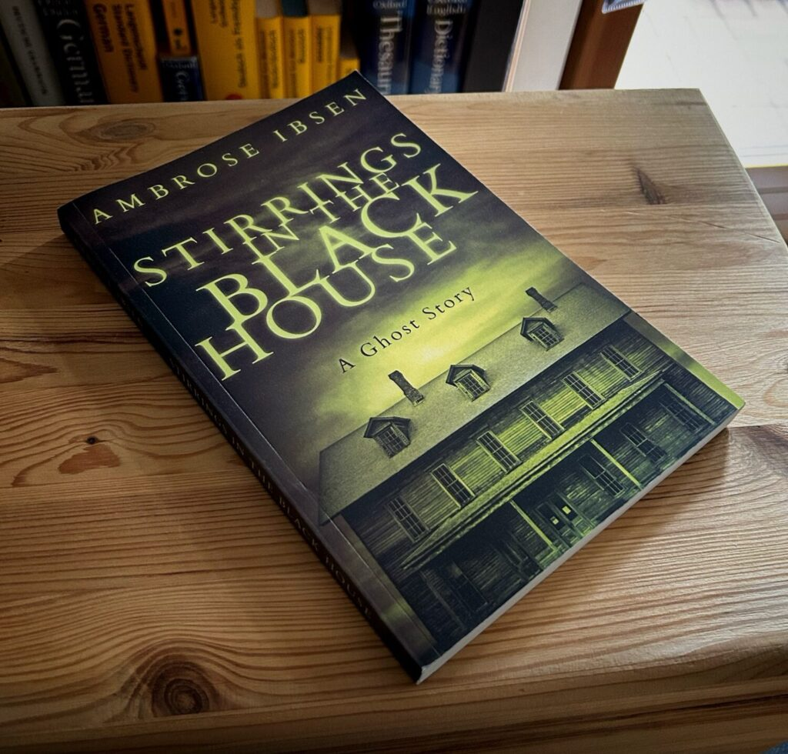

<figure><figcaption>Stirrings in The Black House by Ambrose Ibsen</figcaption></figure>

Most stories I write about on this blog are going to be among my favorites as writing about them gives me the chance to revisit the story and enjoy them a second time. *Stirrings in the Black House* by Ambrose Ibsen is definitely among my favorites.

Before I get into what I liked about it, here is the description from the “back of the book” as copied from Amazon.com:

> When struggling concert pianist Emil inherits a house from his late uncle, he thinks all of his problems are solved. Absconding to the mysterious Weatherby House in the suburbs of Portland where his famous uncle composed many classical masterpieces, Emil finds the place completely empty, save for one thing: His uncle’s grand piano. But Weatherby House is not the ideal getaway it appears at first glance. It has a dark past and is shunned by the locals. As the days pass, strange things occur on the property, leaving Emil to wonder if he isn’t losing his mind. Unplaceable footsteps resound in the upstairs; dark figures peer into the windows at night despite the empty acreage that surrounds the old house, and that blasted piano can’t seem to keep quiet, loosing music at turns beautiful and terrifying even as no one sits before it.In time, Emil discovers that there’s something else living in Weatherby House. And it refuses to let him leave.
> 
> [Amazon.com](https://www.amazon.com/-/de/dp/1973189127/ref=tmm_pap_swatch_0?_encoding=UTF8&dib_tag=se&dib=eyJ2IjoiMSJ9.preewYEV4qFqTPV-pf9Mzd3OqmHHo8jwh10d3a_1t1_vFPud9Emb_MDbvjSAFIGsJQBECtIYW_hJnkkRw9ZXMcLFHE7AmHWjcOiOTKL-fPXZzvobAgOZ5opN_AeZfr7eewvMaSH57SCH8trwWp-2BFAIXPj5EA_ZTYj6VJxvVseZAz9-2oIzsasXRoPezZjjDmmLKs5sGYullBLqJLmwPWe-T4xYTHacUD6U0OJVGQE.rpPHekZ0APRlAxEUWAYegNUH2vn0llyWZ_vck7pAn5c&qid=1725374518&sr=8-1)

A word of advice to those who haven’t read it yet: stop here. ***There are spoilers below.***

So, what did I like about the book? Well, let’s start with the fact that the haunting in the story was actually happening. It wasn’t just a mind-game trying to confuse the reader about whether there was actually a ghost or not. There was a ghost and it was the protagonist, Emil’s, dead uncle who left him the house in his will. Emil’s uncle couldn’t have cared less about his nephew or his well-being which is why his nephew is confused as to why he was left the house.

That reason becomes painfully clear as the story moves on. In life, the uncle was a world-famous pianist and composer. His spirit didn’t want to give that up so he left his nephew the house he haunts so that he would move into it. Emil is also a pianist but isn’t world-famous. In fact, he is struggling to make ends meet.

However, his uncle has a remedy for his problems. He is going to take possession of his nephew’s body, sending Emil’s soul off into the void so that he can reinstate himself as a world-famous pianist using his nephew’s body and pre-existing skills. He successfully achieves exactly this in the end. There is no happy ending which is what makes the book so memorable for me.

In fact, the ending is so not happy that Emil’s girlfriend, who also experiences a lot of the hauntings in the house, also gets trapped by ghosts and her body is “repossessed” by another soul who remains anonymous. At first, the reader thinks she has escaped the fate of her boyfriend because the ghosts in the house let her go in exchange for Emil giving himself up to his uncle without a fight. However, when she gets home, she finds they just followed her to take possession of her. Like I said, not a happy ending.

It was a fairly quick read. The novel wasn’t very long, but was definitely memorable. I would say I can highly recommend it, but if you’ve read this far, you’ve probably already read it. If not, well, you now know how it ends. I warned you. No happy ending for you then either I guess.

*Have you read it? What did you think of it?*