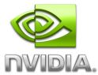
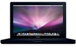
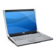
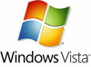

\[digg=http://digg.com/apple/Switching\_from\_a\_Mac\]In technolgy news today it seems that all you hear about are high profile executives and long-time Windows programmers switching to Mac. You never seem to hear the stories about those who go from habitually using a Mac to Windows. The stories are just nowhere to be found. I, however, intend to change that with this post.

As some of you may already know, I have used a Mac for several years now. My first Mac was a 700 MHz iBook with 128 MB of RAM running Mac OS X 10.1. My current Mac is a 1.5 GHz PowerBook G4 with 768 MB of RAM running Mac OS X 10.4 which is certainly not anything impressive. As such, I am in the market for a new laptop, however, this time I have opted to buy a PC running Windows (or Linux; see some of my [earlier posts regarding Linux](http://alexseifert.wordpress.com/tag/linux)) instead of a Mac. Why though?

The first argument I would like to get out of the way is Windows itself. I do not need Windows or any particular application that will run on it and not the Mac. Everything I do and have been doing for work or personal reasons I have been able to do on the Mac without any problems. My primary reason for looking for a PC isn’t the software, but rather the hardware.

The fact of the matter is that Apple’s hardware selection is severely limited and quite expensive. While it does look great and runs fine, I just can’t find any more justification for buying a Mac on hardware dictated by Apple that is more expensive. When looking at laptops or even their all-in-ones, Apple severely limits what kind of video card I can have, the size of hard drive available, etc.

For now, I’m going to just talk about the laptops as that is what I am looking to purchase. As an example, Apple’s MacBook line of laptops only comes with a video card with 144 MB shared memory. The video card is important to me and while Apple does offer a couple of different customization options, the video card is not one of them. There is no other option unless you look at their MacBook Pro line which also comes with a serious price jump.

As a comparison, I have chosen to place Dell’s XPS laptop against Apple’s MacBook. Both are in the price range I am looking to spend on a new laptop ($1000-$1500) and both have similar offers. Below I have listed the specifications for the configuration of each laptop you can get for $1499. The specifications are taken from Apple’s and Dell’s websites.

**Apple’s MacBook** – $1499.00  

-   2.4 GHz Intel Core 2 Duo processor
-   2 GB memory
-   144 MB shared video memory
-   250 GB hard drive
-   SuperDrive 8x (DVD±R DL/DVD±RW/CD-RW)
-   Apple’s iSight webcam
-   13.3″ screen (max resolution of 1280 x 800)

**Dell’s XPS laptop** – $1499  

-   2.4 GHz Intel Core 2 Duo processor
-   4 GB memory
-   256 MB of dedicated video memory (NVIDIA® GeForce® 8600M GT)
-   320 GB hard drive
-   DVD±R DL/DVD±RW/CD-RW drive
-   2 MP webcam
-   15.4″ screen (max resolution of 1440 x 900)
-   Finger print reader

For the same price, the Dell laptop has a much better value. Some of the key differences are that the Dell has almost double the video memory (and it’s dedicated too!), it has a much larger screen with a much higher maximum resolution, it has double the regular system memory, it has a much larger hard drive and it comes standard with a finger print reader. It seems to me that there is a large difference between the two.

Now I know what any Mac enthusiast might argue as I probably would have made the same arguments not too long ago myself. You don’t need a finger print reader. You don’t need all of that memory when you’re running a superior operating system such as Mac OS X that doesn’t consume as much memory as Windows. You don’t need the extra video memory. You don’t need a larger screen on a laptop because it makes it less mobile. You don’t need a bigger hard drive when a superior operating system like Mac OS X doesn’t take up a large portion of it. The quality of the iSight is better than any webcam Dell could put in their computers. And then of course, I can’t forget my favorite one which always serves as a “catch-all” for people Mac enthusiasts: Mac OS X is worth the extra expense!

I read back over the arguments and can’t believe I would have made them at any point in my life. First of all, from my own experience, I can say that Mac OS X *DOES* take up an enormous amount of memory a lot of the time. As my computer has gotten older and applications start to use more and more memory, I have taken on the habit of meticulously managing my memory usage. There are several occasions where I load up the Activity Monitor in Mac OS X and a Mac OS X process (or more than one) is consuming most or practically all of my memory.

Now we come to the video memory. That one is just a dumb argument to begin with as games and any graphics-heavy application require a certain amount of memory no matter what kind of operating system or hardware you are running. Logically, the more video memory you have the better these applications will run.

A larger screen is of course a matter of personal preference. My last two laptops, an Apple iBook and an Apple PowerBook, both had 12″ screens. To be quite honest, I am sick of having a tiny screen and want something much larger. The argument that a larger screen hampers the mobility of the laptop is true, however, mobility is not nearly as important to me at this point as a bigger screen is. One might argue I should just get a desktop then, but the problem with that is that mobility is still important to me; just not as important as a large screen.

We all know that Windows Vista is a hard drive hog so to speak. At a whopping 15 GB, it is an enormous operating system. Mac OS X 10.5 (Leopard) needs 9 GB of hard drive space. But even with a 15 GB operating system, that still doesn’t counter the gain in free hard drive space I would gain by going with the Dell instead of the MacBook.

Then of course we have the webcam and the finger print reader. The iSight might be better quality than that of Dell’s XPS webcam, I don’t know as I have no experience with webcams. And as I don’t intend to really use it, it doesn’t matter to me. Then we have the finger print reader which is just plain cool!

Now for my favorite argument: Mac OS X is worth the expense! No, it is not! While the operating system might not be plagued with viruses, malware and other forms of annoyances like Windows is, it is not worth the extra expense nor the nuisance of not being able to go down to the local computer shop or even Walmart to buy software.

While I still believe Apple does offer a quality product in both hardware and software forms, I don’t think that this “Apple tax” is something I care to continue paying for a computer of lesser ability. Mac OS X’s market share continues to grow, but I believe Apple’s practice of imposing their “Apple tax” on their hardware is either going to have to change or they will have to distribute a version of Mac OS X with an OEM license to other hardware makers such as Dell or HP. Otherwise their market share is going to hit a roof that they won’t be able to get around.