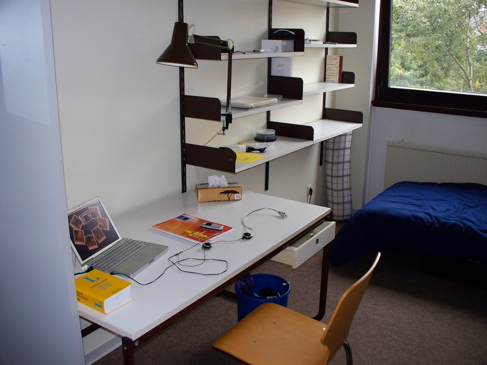
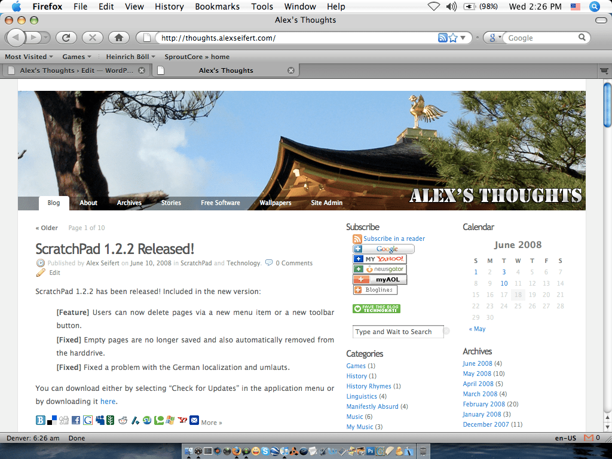
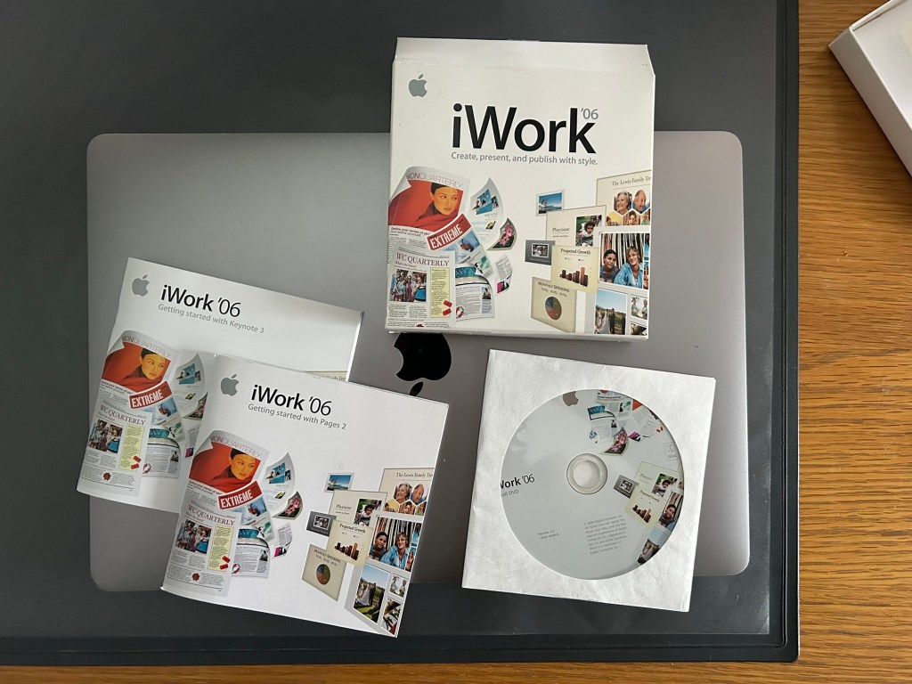

<figure><figcaption>My 12″ PowerBook G4 in 2007</figcaption></figure>

With the start of the new year, I thought it would be interesting to take a look back twenty years to 2006 and remember the Mac applications I used regularly — some of which I still use to this day.

2006 was an important year in my life full of major events. It was the year I graduated high school, then started college at the University of Wyoming. In January, I also came back from spending a year abroad in Japan which means I had two major moves, three changes of school and three massive changes of lifestyle.

One major constant throughout it though was my 12″ PowerBook G4 laptop that I had bought just before leaving for Japan in March of 2005. It traveled with me to Japan, then to Wyoming, then to Germany for another year abroad, then back to Wyoming again. It almost saw me through the end of college when I upgraded to a 13″ MacBook in 2009. As such, I have very fond memories of it and the applications I ran on it.

In the picture above from 2007, you’ll see the PowerBook in my room in Oldenburg, Germany where I spent a year abroad during college. If you squint, you can see the custom wallpaper I used at the time, but the Dock isn’t visible which makes it difficult to see the applications. Fortunately, I happen to still have a screenshot I made on it from that time so we can see what my desktop used to looked like:

<figure><figcaption>Mac OS X Tiger Running on a PowerBook G4</figcaption></figure>

Not all of the applications I am going to list below are visible in the screenshot as my Dock was (and still is) a highly volatile place with programs being added and removed all the time. What follows is a list of the applications I remember using the most.

Adium
-----

Before WhatsApp, Signal and other popular modern messaging services existed, there were AIM, Yahoo Messenger, MSN Messenger and ICQ. Most people had friends that used at least one of these services and it seemed like you could never get all of your friends to agree to use the same one. As such, you would need to have multiple messengers installed on your computer.

To avoid having to launch and maintain these different programs, software like [Adium](https://adium.im) allowed you to combine all of them into one. You only had to open one application and you could chat with people on all of the services you had set up — if they were online. Since there were no smartphones yet and they required a computer with an internet connection, your friends would only sporadically be online and it might take a while before they would reply.

I used Adium for many years starting in around 2002 when I used Mac OS X 10.2 Jaguar (it was called Adium X then). Most of my friends used AIM, but I had family that were on Yahoo Messenger and MSN Messenger which meant I regularly used all three services. A helpful program like Adium meant I didn’t have to take up precious hard drive space with a separate application for each service.

Adium is still available for download for Mac OS X 10.7.5, but hasn’t been updated or maintained in years. Anymore, I primarily use Apple Messages and Signal to communicate with friends and family.

Adobe Photoshop
---------------

Believe it or not, I don’t use Photoshop anymore. In fact, I haven’t really used Photoshop since they moved to a subscription model. [I hate software subscriptions](https://blog.alexseifert.com/2023/11/20/subscription-fatigue-and-software/) which is why Adobe forced me to look for greener pastures like Pixelmator Pro or Affinity Designer. I never could stand GIMP, even though it’s free.

In any case though, I still had and used a copy of Photoshop CS2 in 2006 for my graphics needs. I was into photography at the time, so I used it to edit photos, but I also designed and created graphics and icons for my various programming projects. I still do that but now I use Affinity Designer 2 for vector graphics and Pixelmator Pro for photo editing.

Taco HTML Edit
--------------

This is one of the more interesting applications I used. Despite its silly name and the weirdness of having a taco in your Dock, it was my favorite editor for HTML, PHP, CSS and JavaScript at the time. It had a number of features that we take for granted today such as tabs, syntax highlighting, live previews, and batch editing. It was simple and very effective for the time which is why I used it for so long.

Other than Taco HTML Edit, I also had BBEdit and Xcode in my repertoire of programming tools. Xcode I used (and still use) to dabble in occasional Mac development and BBEdit has been a staple editor of mine for as long as I’ve used a Mac. I can’t remember exactly why I preferred Taco HTML Edit over BBEdit, but there was a reason otherwise I would have used BBEdit which I had purchased a license for.

Taco HTML Edit hasn’t been maintained for a long time, but I also don’t think it would be relevant anymore in today’s world of complex editors such as Visual Studio Code and the JetBrains IDEs. However, for simple editing tasks, BBEdit still really hits the sweet spot which is why [I still use it](https://blog.alexseifert.com/2024/10/01/why-i-just-bought-a-bbedit-license-upgrade/) to this day.

Safari
------

Now we’re getting into some classic staple applications for the Mac. Safari has been my default browser pretty much since it was released with Mac OS X 10.3 Panther in 2003. The first versions had occasional compatibility issues, but it was worth it for the gain in performance and the Mac-native feeling. It also included the nifty SnapBack feature that allowed you to always “snap back” to your search results regardless of how far down the rabbit hole you went. Believe it or not, this feature still exists in Safari, it’s now just hidden under History -> Search Results SnapBack.

In 2006, the main alternatives were Firefox, Opera, [OmniWeb](https://en.wikipedia.org/wiki/OmniWeb), and [Camino](https://en.wikipedia.org/wiki/Camino_\(web_browser\)). Opera and OmniWeb were proprietary browsers that had to be purchased or were shown with embedded ads (Opera) while Firefox felt (feels) like a foreign body on the Mac. Camino was essentially a Mac-native version of Firefox running Mozilla’s Gecko engine with a native Mac interface, but without the ability to add extensions. Compared to Safari, however, it was still slow and clunky.

Ironically, Safari 26 is so slow and clunky on my 2019 Intel MacBook Pro that I can’t use it anymore. If I have more than only three or four tabs open, it becomes so sluggish that it literally takes seconds to switch tabs and the MacBook’s fans start screaming so loudly that it feels like a helicopter is going to take off from my lap. Firefox is, believe it or not, extremely fast by comparison and so I now default to that.

Firefox
-------

I’ve used Firefox consistently since it was still called Phoenix and had bright orange buttons. For the most part, I have used Firefox for web development purposes because of the breadth of development tools that have been available for it since its inception. By 2006, it was firmly ingrained in my development workflow. Safari didn’t always have developer tools and even now, they are clunky compared to what’s available in other browsers. For a while, I used Chrome for development, but I still much prefer Firefox.

I’ve also had phases where I used Firefox as my default browser rather than Safari. The reasons range from the pragmatic (see the above issue with Safari 26) to the emotional (I just felt like it). Usually, it didn’t last long because Firefox is still much clunkier than Safari on a Mac.

Below is a later screenshot of Firefox 3 from 2008 running on my PowerBook G4 under Mac OS X Tiger. Believe it or not, the blog depicted on it is this blog even though it was called something else and was located at a different subdomain. [This is the post](https://blog.alexseifert.com/2008/06/10/scratchpad-122-released-2/) that is shown. Also, you can see the novelty taco in my Dock in this screenshot.

<figure><figcaption>Firefox 3 running on my PowerBook G3 under Mac OS X Tiger</figcaption></figure>

Apple Mail
----------

Apple Mail has been my choice of email client since I first used it in Mac OS X 10.1 Puma. I’ve always found it to have just the right amount of features for my needs without there being too much bloat. I was happy, however, when Apple stopped using a drawer for the postboxes and made them a fixed part of the interface within the window proper. By 2006, that was already the case and Mail was unbeatable.

I have, of course, experimented with other email clients such as Thunderbird, Entourage and Outlook. There was a brief phase in late 2005/early 2006 where I actually used both Firefox and Thunderbird as my defaults, but it didn’t last long. As far as Microsoft’s email clients go, I used Entourage for a while to access my university Exchange account and, later, its replacement, Outlook, for work. Unfortunately, I’ve found Apple’s support for Exchange calendars flaky at best, so I tend to stick to Outlook for work even though I would prefer using Mail.

iTunes
------

I have fond memories of iTunes. I used it as my main music player until it was replaced by Apple Music on the Mac in 2019. I started using it on both Mac OS 9 and Mac OS X shortly after Apple purchased it in 2000. Before Apple renamed it, it was called SoundJam.

By 2006, I’d been using it to play music, rip and burn CDs, and for purchasing music for $0.99 a song. It was scandalous when they raised the price to $1.29 for the higher quality songs. I still listen to some of the songs I purchased back then from the iTunes store such as *See You On The Other Side* by Korn. Fortunately, their DRM decoding still works even in the newest version of Apple Music.

Ironically, I used iTunes on my Windows PC much longer than on the Mac since it was the only way to officially access Apple Music (the streaming service) from Windows without using their [web interface](https://music.apple.com) for much longer than on the Mac. Eventually Apple Music (the application) came to Windows too, though.

GarageBand
----------

When the first version of Apple’s GarageBand came out in 2004, I desperately wanted it. I not only love listening to music, but also creating it. It took me several months to get it after its release though since I was broke and was still financially dependent on my parents. By 2006, I had only had it for less than a year, but I had put a massive amount of hours into it composing songs and experimenting. Admittedly, the music I created at that time was pretty atrocious, but you have to start somewhere.

I haven’t used GarageBand in quite a while, although I did tinker around with the version for iPad about a year ago. Since 2006, I’ve moved on to more professional-grade software like Logic Pro and Propellerhead Reason.

Propellerhead Reason
--------------------

My parents bought me a license for [Propellerhead Reason](https://www.reasonstudios.com) for Christmas in 2004. Originally, its focus was on electronica and DJing — the former of which I was heavily into at that time — but it has since developed into a full-fledged DAW. While not as well-known or popular as other DAWs (digital audio workstations) such as Logic Pro, Cubase or Pro Tools, I’ve always found Reason to be more intuitive.

I used it heavily in 2006 since it was my first professional-level DAW. I’ve since composed and recorded numerous albums with it both on my own and with bands. In fact, I just upgraded to the latest version (13) last month. You can see the red and black Reason icon in the Dock in the screenshot at the top of this post and I can tell you that it’s still in my Dock to this day, even if the icon looks a bit different. In fact, looking through [screenshots of my desktop](https://blog.alexseifert.com/2024/09/15/my-collection-of-mac-os-screenshots/) throughout the years, you can see that Reason is one of the icons that is a constant in my Dock.

iWork ’06
---------

In 2006, I had a lot of essays to write for college. My university’s IT department provided all students with a Microsoft Office license (even for Mac users), but my preference was, unsurprisingly, iWork. In school, I had used AppleWorks and its successor was even better in many ways. What I enjoyed about it most was that, like Apple Mail, it had just the right feature set for me. It had exactly what I needed and hardly anything else. It was minimalistic without sacrificing essentials. In fact, I would argue Pages, Numbers and Keynote still brilliantly maintain this legacy and it is still the reason I prefer them to Office.

Apple wouldn’t make them available for free for many years yet which meant that in 2006, I had to purchase a license for them. While iWork cost less than Microsoft Office, I would have gotten Office for free from my university which meant iWork was more expensive for me to buy. It was worth it though and I regret nothing.

At the time, it came in a box with an installation DVD. Here’s a picture of the boxed retail version of iWork ’06 that I purchased from the Apple Store at Aspen Grove in Colorado in 2006. Since I still have it, I decided to take a picture of it on top of my 2019 16″ Macbook Pro specifically for this post. It includes one installation DVD and is otherwise mostly paper manuals — certainly a rarity today.

<figure><figcaption>The retail version of iWork ’06 I bought in 2006</figcaption></figure>

Conclusion
----------

Thinking back to all of the many, many programs I’ve used throughout the years was a fun exercise. It was hard to remember what exactly I was using in 2006 since the years tend to blend together a little bit when it comes to software, but fortunately, I had some old screenshots to help me out. Staples like Safari or Apple Mail were no-brainers, but I couldn’t remember exactly when I started and/or stopped using others like Taco HTML Edit and Adium.

While compiling the list, I was actually quite surprised to see how little has actually changed in the intervening twenty years. Even though many applications have come and gone, it is incredible how many of them I still use today. Habits die hard, I guess.

The idea for this post came from the blog [512 Pixels](https://512pixels.net/2025/12/five-apps-i-used-in-2005/) where its author examines five Mac applications he used in 2005.