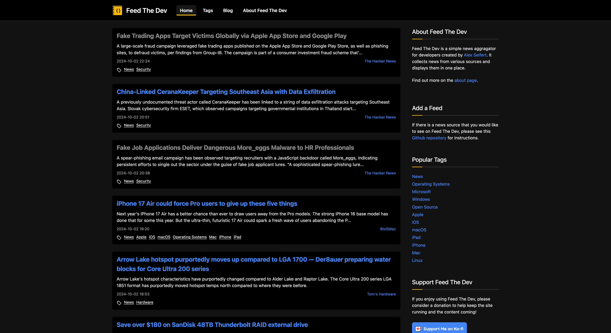

<figure><figcaption>Feed The Dev</figcaption></figure>

I’m excited to announce an all-new version of [Feed The Dev](https://www.feedthedev.com/) that I’ve been working on for the past few months! It is now an aggregate website for development and technology news and articles that combines sources from all over the internet into a single, easy-to-use website.

The website works by using RSS and Atom feeds. If you would like to see which feeds are included or even add your own, check out the [Github repository](https://github.com/feedthedev/feeds) that contains the `feeds.json` file with all of the sources. Feel free to submit a pull request with any additions!

I purchased the domain for Feed The Dev a while ago with the intention of creating exactly such an aggregate website but then decided to make a blog out of it instead. I ended up turning my old technology blog, Developer’s Notebook, into Feed The Dev. Since I haven’t been posting on that blog, I decided to return Feed The Dev to the purpose I originally intended for it.

Technologies
------------

Of course, we have to discuss the technology stack I used to create it. And it might surprise some of you. I chose none other than PHP with the [Symfony framework](https://symfony.com/) to build the site. Since it’s also hosted on Linux and uses a MariaDB database, you might even say I chose your classic LAMP stack.

The question, as with any tech stack, is why I chose it. Well, my reasons are entirely pragmatic. I rent a virtual server running Ubuntu that hosts several WordPress websites. These use PHP and MariaDB. Since one of my server administration philosophies is to reduce the amount of packages installed on a server to a bare, safe minimum, I didn’t want to install Node or anything else on it. Plus, I already have a deployment process in place for PHP sites and would have to create everything from scratch for a different technology. Therefore, I chose PHP.

The other primary reason is that if I ever need to move it to its own server LAMP stack servers are cheap and available everywhere. That is not the case with Node, for example, where you would need to rent a virtual or root server which could be significantly more expensive.

The development experience was interesting since I frequently used Symfony over a decade ago and some things have changed quite a bit in the meantime. I will write another post about that soon.

Conclusion
----------

In any case, I hope you enjoy the new version of [Feed The Dev](https://www.feedthedev.com/) and of course, I would welcome any feedback or [pull requests](https://github.com/feedthedev/feeds) with feeds you would like to see on there.

You can find the website at [https://www.feedthedev.com](https://www.feedthedev.com).