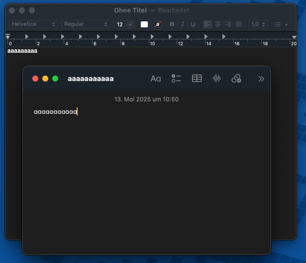

Yesterday, I came across [an article on Engadget](https://www.engadget.com/apps/the-only-thing-i-want-from-apples-big-2025-redesign-is-a-120023531.html) where the author pointed out a very odd discrepancy in Apple’s use of fonts:

> There are a lot of rumors flying around about a big iOS and macOS redesign coming this year, perhaps as a distraction to the continued issues around Apple Intelligence. And while I’m game for a fresh coat of paint across the software I use every single day, I have one plea while Apple’s at it: Please, for the love of god, make the Notes app render the letter “a” properly.
> 
> Let me back up a bit. Apple first introduced the San Francisco typeface with the first Apple Watch in 2015; a few years later it became the default on basically every device Apple sells. The text you see in Messages, Apple Music, Maps and many other system apps are all different San Francisco fonts, and for the most part the multiple variations all feel consistent and cohesive.
> 
> But, at some point in the last seven or eight years I noticed something odd in the Apple Notes app. The font *appears* the same as the other San Francisco fonts, but something just felt “off.” It took forever before I put my finger on it: the lowercase “a” renders differently in the Notes app than it does anywhere else across the entire system.
> 
> You see, the Notes app uses a “single storey a,” the sort of “a” that most people use when writing by hand. That’s the only first-party app, as far as I can tell, where you’ll find a single-storey a. The rest of the time, it uses the double-storey a (just as you’ll see on this website and almost everywhere else a lowercase a is used these days outside of handwriting).
> 
> [Engadget](https://www.engadget.com/apps/the-only-thing-i-want-from-apples-big-2025-redesign-is-a-120023531.html)

I had never noticed it until I read the article, but it definitely is that way. I just tried it out and took a screenshot:

<figure><figcaption>The different a’s</figcaption></figure>

You can even see that the title bar of the Notes app has the standard double-storey a whereas the note itself does not. Not pictured here is that the rest of the fonts used in these apps appear to look exactly the same. The article has a much better example of it side-by-side, but I don’t want to copy their image, so I’ll just recommend you take a look at it on [Engadget](https://www.engadget.com/apps/the-only-thing-i-want-from-apples-big-2025-redesign-is-a-120023531.html).

This has never really bothered me because I never noticed it, but now it does. As the author pointed out, something always felt a little bit off with the font in Notes, but I hadn’t noticed what it was until now. Maybe Apple will fix this? Or is a feature? Presumably so if they went through the effort of having a separate font for Notes.

Here the original article on Engadget: [https://www.engadget.com/apps/the-only-thing-i-want-from-apples-big-2025-redesign-is-a-120023531.html](https://www.engadget.com/apps/the-only-thing-i-want-from-apples-big-2025-redesign-is-a-120023531.html)