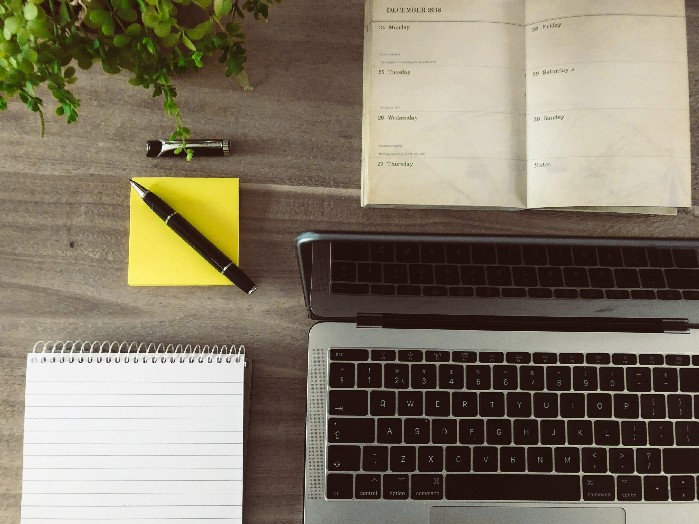
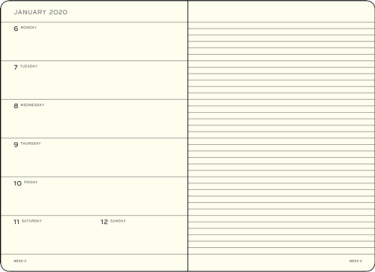

<figure></figure>

Like so many other people out there, I have a lot to do. There is always some project that is calling, some person needing an answer from me, some book that is begging to be read, some piece of writing that won’t compose itself, etc. Over the years, I have tried a large number of different methods for organizing myself and increasing my productivity. These range from digital solutions that promise to be the ultimate tool to increase one’s productivity to simple analog solutions using pen and paper.

And yet none of the tools I’ve tried have been that promised be-all and end-all solution that magically boosts my productivity.

I have, though, managed to narrow it down over the years to a specific set I use depending on the type of task at hand. In this post, I am going to talk a bit about which tools I use in which contexts with the intention of hopefully helping someone choose the right one for their needs.

Moving from Analog to Digital
-----------------------------

<figure><figcaption>Paper Planner Format</figcaption></figure>

Last year, I switched from a largely analog organization system to a fully digital one. For years, I used paper planners with a weekly format that had the days on the left and a blank page on the right side of the spread which I would use to plan my to-dos for the week. This list of tasks I would transfer from week to week which was tedious, but since I had to do it by hand, it meant I re-evaluated each and every item on the list every week. Through this method, unimportant to-dos would eventually be dropped entirely freeing up both physical and mental space for more important things.

This system worked very well for a long time. Then I started a new job where I got a new iPhone, a new iPad Air with an Apple Pencil and a new MacBook Pro. I’ve had various smartphones and tablets over the years, but with the excitement of the new equipment, I decided to finally make the plunge into an all-digital system.

Apple’s Apps and Services
-------------------------

Naturally, the first thing I did was try out Apple’s pre-installed apps. I needed a planner, a way to manage my to-dos and a place to take notes. Apple offers all of these with their Calendar, Reminders and Notes apps, respectively. For files in the cloud, I also tried out iCloud Drive. All of these are built into iOS, iPadOS as well as macOS and sync automatically between all of my Apple devices. Since I also use a Mac both at work and at home, I thought this would be the best solution. For the occasional Linux machine I use, I could always access everything through iCloud.com.

And for a while, I was happy with this solution — until I wasn’t anymore.

Apple’s apps work very well, but they are basic. My wife and I still use them for our shared calendar, to-do lists and notes and that works wonderfully for our simple sharing needs, but I needed something a bit more elegant to organize not just my personal life, but also the various projects I am always working on.

Until that point, I had been using two systems: one for organizing my personal life and one for my projects. For the latter, I had been using a combination of a self-hosted instance of Confluence, Apple Notes and random Markdown files on my computer.

That wasn’t very efficient, so I decided to simplify and find a solution that would allow me use one method for organizing both my personal life and my projects. Unfortunately, Apple’s tools just weren’t quite up to what I needed.

G Suite
-------

Not too long ago, I moved my personal email address to G Suite, Google’s paid competitor to Microsoft Office. I chose G Suite for the simple reason that my email address is over twenty years old and I need an exceptionally good spam filter. I’ve had good experience with Google’s, so I decided for G Suite and haven’t regretted it once.

I had, however, been accessing my email through Apple Mail on all of my devices despite the existence of a Gmail app for iOS/iPadOS and the excellent web interface for desktop. That meant I hadn’t been privy to the capabilities that G Suite offers for organization and planning.

So I decided to have a look since I was paying for it already anyway.

Gmail’s integration with Google Calendar, Google Keep and Google Tasks is superb. Appointments are automatically made in Google Calendar from emails in your inbox, emails can be added to your tasks lists and the sidebar in Gmail on the web allows you to quickly access all of your notes in Google Keep.

This sort of integration doesn’t exist in Apple’s products without jumping through a few hoops first and then it doesn’t always work very well or reliably. Especially when it comes to adding emails to the Reminders app.

G Suite does have some negative aspects to it though. Google Tasks is even more rudimentary than Apple Reminders and while Google Keep is great for keeping small notes and lists, it doesn’t not serve well for complex or large notes. The iOS/iPadOS apps for Gmail, Keep, Tasks and Google Calendar work very well, but they don’t work well together without first going through the web interface on a desktop computer. They might on Android (I don’t know), but not on Apple devices. It isn’t possible to, for example, add a .ics file to my Google Calendar from another app (including Gmail) or add an email to your task list like you can in the web interface.

No system is perfect, but I’ve found Google’s to generally be more robust than Apple’s and the way everything works together so well on the web is a huge plus. Not to mention that data synchronization works more reliably and quickly than Apple’s where you sometimes have to wait a while for changes to show up.

The other big benefit of G Suite is Google Drive. iCloud Drive is, frankly, miserable to use for files. It starts with having only 5 GB of space on the free tier vs. G Suite’s 30 GB (albeit paid, but even the free version of Google Drive has 15 GB of space). Without the ability to even decide which folders you want to synchronize, iCloud Drive is a barren wasteland when it comes to features. It does synchronize files well, but it synchronizes all of them all of the time to every machine that is logged into your Apple ID. Since I have some larger files I don’t necessary want on every computer, that wasn’t going to work for me.

A Combination of Applications
-----------------------------

Both Apple’s and Google’s systems have their shortcomings which means you will always need to make compromises. Essentially, what I have settled on is a combination of applications by both Google and Apple.

### Personal Organization

For my personal life, I have settled on the following:

-   Calendars
    
    -   Apple Calendar for my personal calendar and the calendar my wife and I share
    
    -   Both are accessed through the Apple Calendar apps on both iOS/iPadOS and macOS
-   To-Dos
    -   Apple Reminders which hosts my “master lists” as well as for shared to-dos
    -   Google Notes to create specific, temporary to-do lists; for example, “To Do Before My Sister Visits”
-   Email
    -   Gmail accessed via Apple Mail on both iOS/iPadOS and macOS. Occasionally, I use the web interface for marking email as spam or other Gmail-specific features like filters
-   Notes
    -   Google Keep for quick notes, reminders, small lists like shopping lists
    -   Apple Notes for most other things including shared notes with my wife
    -   Google Docs & Sheets if I need to share something with a larger audience (i.e. extended family)
    -   GoodNotes. This is the only non-Google/Apple application. I use it on my iPad with my Apple Pencil as I find writing by hand is better for thinking and the old-fashioned concept of notebooks and pages makes it easier for me to organize my thoughts.
-   Files
    -   Google Drive for almost everything
    -   iCloud Drive for synchronizing files within apps and app/iOS/iPadOS backups

### Project Organization

For project planning and organization, I mostly use the system as mentioned above:

-   To-Dos
    -   Google Keep for project to-dos
    -   Google Drive via Docs & Sheets are where my master to-do lists reside in this case as I have so many projects that it would just lead to clutter in Apple Reminders. I always create a project folder in Google Drive where I then create a Google Doc or Google Sheet to use as a master to-do list.
-   Notes
    -   Google Docs & Sheets. I create Google Docs as needed for notes, planning, concepts, etc.
    -   GoodNotes. Same as above — writing by hand helps me think. I create a new notebook for each project.
-   Files
    -   Google Drive. Files go into the project folder I always create.

Other Options
-------------

There are, of course, a lot of other viable digital solutions available on the market. So, what about those?

I briefly looked at other companies’ software and ecosystems (Microsoft’s, Zoho’s and several other smaller companies’), but I decided to stick with Apple and Google because, together, they cover my needs very well. The only except there is GoodNotes, but that uses iCloud to sync and Google Drive for backups, so it’s not entirely outside of the system.

I am also already paying for G Suite (and for its spam filter) which means I don’t really want to pay for another system on top of it.

Conclusion
----------

When I set out to simplify my organization system, my primary goal was to consolidate everything into one system flexible enough to accommodate everything I need. I quickly found that to be a tricky task as can be deduced from the large list of different programs and services I have included above.

What I really wanted was one single service, one single offering that gave me everything I was looking for, but I wasn’t able to find it. Each one had its own quirks and shortcomings that made it difficult to use by itself which is why I had to settle in the end for a combination of Apple’s and Google’s services and apps.