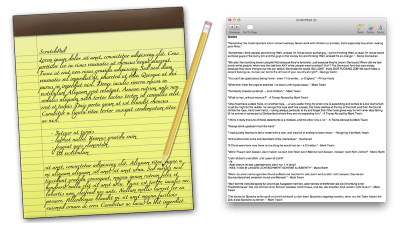

ScratchPad

Since it’s been a few months since I wrote [my last progress update on ScratchPad 2.0](http://scratchpad.alexseifert.com/2014/11/08/progress-on-scratchpad-2-0/), I thought I would write a bit about where the development of the new version currently stands.

Although ScratchPad isn’t a particularly complex program, rewriting the whole thing from the ground up is still a time-consuming process. Unfortunately, it was absolutely necessary because I didn’t really know what I was doing when I first started ScratchPad. I started it on Mac OS X 10.4 (Tiger) and there have also been a lot of advancements in terms of built-in technologies to OS X that I wanted to take advantage of. The easiest way was to just rewrite the code rather than try to bend the old code to fit the new technologies.

According to [GitHub](https://github.com/eiskalteschatten/ScratchPad), the last time I worked on ScratchPad 2.0 was in March, so a little over a month ago. I am continuing to work on it in between the other things that eat up my time as I would really like to finish it as soon as possible. Not only is version 1.x ugly in Yosemite and not Retina-compatible, it is also unstable and I have had a lot of complaints about people losing notes. These are things that I want fixed sooner rather than later. I will continue to work on it when I can and promise to finish as soon as I possibly can.

The easiest way to keep track of ScratchPad 2.0’s development progress is to watch out for commits on [the GitHub page](https://github.com/eiskalteschatten/ScratchPad).