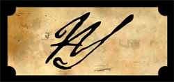

The Tower Room

**The Tower Room**

I’m very pleased to announced that I have officially released my new album, “The Tower Room”. It comes a year and two days after the release of “The Pantry” and is the product of many long hours of writing and recording. “The Tower Room” is a whole new direction for my music. While I have always tended to write darker music, I have now combined that with a more metal-like sound with the heavy use of guitars, bass and drums.

The album can be streamed for free on [the music page](https://www.alexseifertmusic.com/#music) and is available for purchase on the [iTunes Music Store](itms://itunes.apple.com/gb/album/the-tower-room/id978141703) in many different countries. Spotify users will also find it available on Spotify soon. “The Tower Room” is also available in several different shops. A more detailed listing can be found in [the shop](https://www.alexseifertmusic.com/#shop).

  [United States](itms://itunes.apple.com/us/album/the-tower-room/id978141703) – $7.99

  [United Kingdom](itms://itunes.apple.com/gb/album/the-tower-room/id978141703) – £5.99

  [Germany](itms://itunes.apple.com/de/album/the-tower-room/id978141703) – 6,99 €

  [France](itms://itunes.apple.com/fr/album/the-tower-room/id978141703) – 6,99 €

  [Japan](itms://itunes.apple.com/jp/album/the-tower-room/id978141703) – ¥1,200

**The New Website**

My website has also received a significant makeover to mark the release of the new album. It is darker, more gloomy and fits the mood of the new album far better than the previous design. It also makes use of many more modern web technologies making it a more interesting website with animations, sounds, etc. Another major update is the new player for songs which is now compatible with devices such as Apple’s iPad and iPhone that don’t support flash players.

New Logo

**The New Logo**

The last significant update is my new logo. It is a logo created to be simple yet to fit the darkness of the music on “The Tower Room”. The “AS” in a handwritten, gothic-style font was chosen because it fit these criteria perfectly. While it appears on the website in a box, the logo itself is just the letters “AS”. It is simple, yet slightly unnerving which are two adjectives I have heard used to describe the new album.