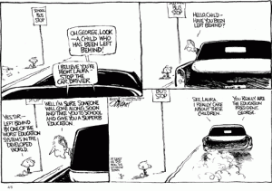
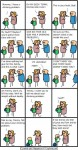

I found [a very interesting commentary](http://www.cnn.com/2009/LIVING/03/30/cafferty.schools/index.html?iref=mpstoryview) on CNN about the state of our education system here in the United States. It’s really quite sad, but at the same time, it’s true. I advise you to read [the whole article](http://www.cnn.com/2009/LIVING/03/30/cafferty.schools/index.html?iref=mpstoryview), but there are a couple of parts in particular I would like the highlight here.

> We’ve witnessed the decline of the importance of schooling in far too many homes. Learning must be a top priority for parents. But in today’s brutal economy, breadwinners are forced to work two jobs, two parents sweat to keep their jobs and homes, and the kids get left unsupervised. They go online, text their pals, stare at the tube (or YouTube), and play video games. They’re not dashing out to the public library to research renewable fuels or Renaissance history.

US Education System

First of all, the parents are indeed to blame for part of the decline in education in this country. I understand many families are in a situation where both parents have to work in order to survive. This means they cannot be with their children as much as they would like to be and leads to a situation where a nursery or daycare ends up raising them. This, I believe, is where the problem starts. By the time the parents and children are at home together, everyone is too tired to do anything productive. This means that the children’s home environment is hardly conducive to an educational atmosphere. Instead, the parents and children sit themselves in front of the TV or computer and vegetate until they go to bed.

Let me take a step back. While it may be true in a lot of cases that both parents have to work to survive, let’s take a look at what it means to “survive.” In my opinion, this does not mean having the latest and greatest technology, having two or three new cars or having an over-sized house. Those are things which can be done without and should even be sacrificed for the sake of your children. If both parents have to work to be able to afford two new cars and a huge house, then maybe downsizing is in order so that one parents either doesn’t have to work at all or can work part time. This would allow time to devote the children.

Unfortunately, too few people agree with me on this point. They would rather just put their pesky children in a day care and enjoy their enormous HD flat screen TV in a house that could fit twice as many people comfortably.

No Child Left Behind

Then of course we have No Child Left Behind.

> One major bone of contention among parents and educators was Bush’s 2001 No Child Left Behind (NCLB) Act, whose focus was squarely on standardized, multiple-choice test scores in Math and English rather than on the quality (and deeper grasp by the student) of the curriculum.

Bush’s No Child Left Behind act has probably been one of the worst things to happen to the American education system since its inception. I understand the underlaying principles behind it, but the problem is that standardizing everything does not help the situation. On the contrary, it only makes it worse. Then of course you have the problem of the standardized tests. Suddenly the federal government is requiring that our schools have to teach to a test. That means the students learn how to take a test, but that does **not** mean that they actually learn the necessary content. We are going to have a generation of test-takers who leave school knowing very little of what they actually should have learned.

The ramifications of such an act on the education system goes even deeper than just that. Students who are intellectually gifted and are able to pursue more difficult subjects or grasp more difficult concepts are suddenly being stifled and held at the handicap of the least capable of the class. Why should these people be held back instead of encouraged to excel? We, of course, don’t want to make the people who struggle with school feel stupid because some people are more capable, do we? *(Note the sarcasm.)*

Then we have the drinking problem.

> As Mark from Philadelphia wrote, “Having just been a high school student less than a year ago, I can tell you how rampant the alcohol and drug problem among our youth is. I can literally only name one peer of mine who has not done marijuana, and not one who has not drunk alcohol. This is just one necessary step in reforming our schools.”

Drinking Problem

As a relatively recent high school graduate, I can assure you that what Mark from Philadelphia wrote above is unfortunately quite accurate. I knew several people who regularly smoked marijuana in their parents’ basement or in their friend’s parents’ basement. But while I knew more than just one peer that did not do marijuana, I hardly knew anyone that did not drink and party excessively. Let me remind the reader that this is high school we’re talking about. We’re not even talking about college students yet!

Since students are generally unmotivated to work hard in school and because schools need to simply allow students to get good grades and pass in order to receive funding (thank you, No Child Left Behind), they do not study hard at school. They do not even try. They do the minimal amount of work required to pass with a C and are perfectly content walking away knowing nothing. The strive for knowledge is gone with high school students. Instead of using their time studying, they use it for partying, drinking and smoking marijuana since they have nothing better to do. Those who do not feel the need to party excessively are then labeled as ‘nerdy’ and anti-social and thus cast out. That’s certainly not leaving any child left behind!

We are creating a society of idiots whose sole existence is to party and drink. This is a problem that desperately needs to be solved in order to meet increasing competition from the international community. If we don’t fix it, we are going to be in some serious trouble and soon.

Again, I recommend reading [the commentary](http://www.cnn.com/2009/LIVING/03/30/cafferty.schools/index.html?iref=mpstoryview) from CNN.