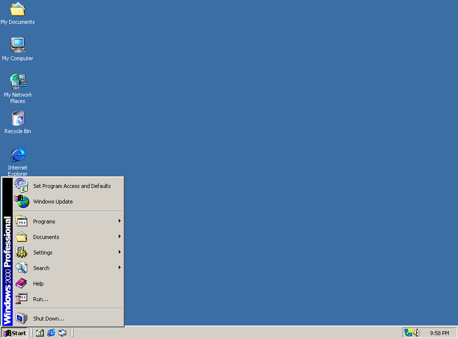

<figure><figcaption>The Windows 2000 default start menu</figcaption></figure>

I recently ran into an article over at [Ars Technica](https://arstechnica.com/gadgets/2015/08/the-windows-start-menu-saga-from-1993-to-today/) that contains the history of the Windows Start menu complete with screenshots of each major release of Windows, including a few beta versions. The article is a decade old by now and was spurred on by the twentieth anniversary of the release of Windows 95 as well as the release of Windows 10, which reintroduced the Start menu after the Windows 8 debacle. Given its age, it doesn’t include Windows 11, but it is still interesting nonetheless for those interested in the evolution of Windows.

> Windows 95 launched exactly 20 years ago today, and though the operating system is long dead many of its ideas still live on. In celebration of 95’s 20th birthday, we’re revisiting our piece on the evolution of the Windows Start menu. Cut yourself a slice of cake and relive the memories.
> 
> One of the first Windows 10 features we learned about was the return of the Start menu, which is sort of funny, since the concept of the Start menu is over two decades old. Microsoft tried to replace it with the Start screen in Windows 8, and [you only have to look at the adoption numbers](http://www.netmarketshare.com/operating-system-market-share.aspx?qprid=10&qpcustomd=0) to see how most consumers and businesses felt about it.
> 
> The Start menu has changed a lot over the years, but there are a handful of common elements that have made it all the way from Windows 95 to Windows 10. We fired up some virtual machines and traveled back in time to before there *was* a Start menu to track its evolution from the mid ’90s to now.
> 
> [Ars Technica](https://arstechnica.com/gadgets/2015/08/the-windows-start-menu-saga-from-1993-to-today/)

For some, it might be interesting to see its humble origins in Windows 95 while for others, it will be a trip down memory lane. I remember each version distinctly even though I hardly used Windows Vista or Windows 8. I also remember Windows 3.1 before the Start menu made its appearance, although it was already obsolete by the time I was old enough to really use a computer.

Regardless of which camp your in, I can recommend taking a look through the screenshots and explanations. It’s definitely an interesting bit of computing history! You can find the article here: [https://arstechnica.com/gadgets/2015/08/the-windows-start-menu-saga-from-1993-to-today](https://arstechnica.com/gadgets/2015/08/the-windows-start-menu-saga-from-1993-to-today)