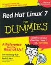
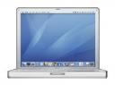

\[digg=http://digg.com/linux\_unix/Thinking\_of\_Linux\]I haven’t always been a big Mac fan. As I think it is with most people, I used to use a Windows PC, but unlike most people, I quickly realized how much I wanted out of the world of Windows. Even as early as high school, I began to look for alternatives to the Microsoft horror that is Windows. The obvious conclusion I came to as a completely broke high school student was Linux.

At the time, I was running a Gateway PC with a 433mhz Intel Celeron processor. I don’t remember any of the other specs at the moment, but I do remember that it had a sticker on the front saying that it was specifically designed to run Microsoft Windows 98, which dates it quite a bit. I had already upgraded from Windows 98 which the computer had come with to Windows 2000 and despite the noticeability in improvement, I still wasn’t satisfied with my computer’s reliability and performance.

Of course, I had heard of the Mac and had even used them in school. I was extremely interested in trying a Mac (at the time that would have been the classic Mac OS 9), but considering I had absolutely no money and the computer I was using was already a hand-me-down, I had to find another solution. Searching through the internet, I learned about this great operating system called Linux. I looked through several distributions and had no idea what I was looking at or what any of the terminology meant. I made my final distribution decision purely out of aesthetic reasons. My decision was Red Hat Linux 7.

Of course, I also had no idea how to download it and install it. The term “ISO” meant absolutely nothing to me, much less knowing what to do with it once it was finally downloaded. I decided instead that I would go get a Red Hat Linux 7 book that would explain everything. At the bookstore, I chose *Red Hat Linux 7 for Dummies* because it came with installation CDs of the operating system. I made the purchase because it not only explained how to use Linux, but also rid any need of downloading ISO’s and then trying to figure out what to do with them.

After coming home from the bookstore, I quickly backed up any files on my Windows PC that I considered important, then I wiped the hard drive and installed Linux. By then I had had enough experience formatting and (re)installing Windows, that I was comfortable with that part of the procedure. After successfully installing Linux and running it for the first time, I was brought to the terminal. I was also fairly comfortable with terminals because I had used a lot of MS-DOS machines. Given, I didn’t really know any Linux/Unix commands, but that’s where that handy book came into play. After playing around in the terminal for a while, I decided to give the GUI’s a try. In the installation, I had been given the option to either install GNOME or KDE or both. Not even having the slightest clue as to which one was better, I installed both. This might seem extremely redundant to any casual Linux user, but I was new. I first chose to run GNOME. Of course, I played around with GNOME for about an hour and then I tried KDE. After playing with both and going back and forth for a few days, I decided that I liked GNOME better. The only reason was because I thought it looked better. (But then again, what is a GUI if it doesn’t look good?)

With my handy book, I used Linux for quite a while and loved every minute of it. I used the Mozilla suite for my internet needs and I used the GIMP for my photo and image editing needs. Most of my basic computing needs were taken care of with freeware that either came with Linux itself or that I downloaded and installed. The problem that I ran into, however, was the other software that I needed, but wasn’t available for Linux. At the time, OpenOffice.org really didn’t exist, so there was really no comparable software suite for Linux to Microsoft’s Office. There was something called StarOffice that I tried to use, but it never really did do quite what I wanted. I also made (and still make) a lot of music and there wasn’t (and still isn’t) an equivalent to Propellerhead’s Reason software which I use to make a good portion of my music.

In the end, I decided to go back to Windows. Fortunately, it was only temporary because not too long after I moved back to Windows, I was able to buy my first Mac. I bought an Apple iBook with a 700 mhz G3 processor. It came with OS X 10.1 installed. In 2005, I upgraded to a PowerBook G4. Considering that was almost 3 years ago (which is a very long time in technological terms) and this laptop has traveled faithfully with me to several different countries, it’s about time to buy another computer.

When I say this, I’m not saying that I don’t like Apple anymore, but they aren’t the company they were when I bought my first Mac and the change hasn’t exactly been for the better in my opinion. The success of the iPod has brought about a certain prude air to them that I’m not really a fan of. So, naturally, I’m looking for alternatives while still avoiding Windows. This obviously brings Linux back into the picture. I have done quite a bit of research into Linux distributions and this time I know (for the most part) what I’m looking for and what all of the terminology means. The Linux distribution that I decided on was Ubuntu Linux. It fits pretty much all of my needs and also looks good.

There is still a problem, however. Compared to when I first tried Linux, the amount software available for Linux users and the popularity of the operating system itself have increased tremendously. One of my two major problems before has been solved with OpenOffice.org (which I have used on Windows PCs when I am forced to use one for some reason or another). The other problem, a Linux equivalent or replacement for Propellerhead’s Reason, is still not solved. This software is crucial to me and my music career. If you know of an equivalent or something, *please* let me know.

That should just leave one problem, but actually there is a new need involved that wasn’t a factor last time I tried Linux. Since I am a college student and I travel all of the time, I really need a laptop. As far as I know, and correct me if I’m wrong (please!), the only way to get a laptop is through a major distributor which also involves purchasing an OEM license for whatever the preinstalled operating system is (be it Windows or Mac OS depending on who you buy the hardware from). I don’t know of any laptop makers that sell laptops without a preinstalled operating system or with a Linux distribution as an option for the operating system.

As I said before, if you know of an equivalent or a replacement for [Propellerhead’s Reason](http://www.propellerheads.se/products/reason/) (click on the name for more details on what it is), **PLEASE** tell me. I would love to use Linux, but that is the primary reason I am holding back. If you also know of a place where you can buy a new laptop without an operating system or with Linux preinstalled, please let me know. You can send me an e-mail at seifertalex \[at\] gmail \[dot\] com or just leave a comment here. Thanks!