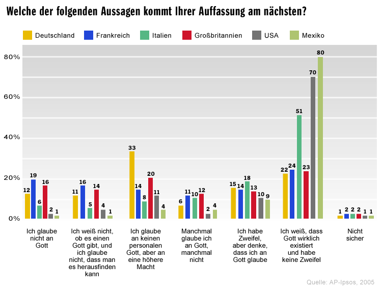

[This](http://www.spiegel.de/fotostrecke/fotostrecke-39129-4.html#backToArticle=603333) is extremely embarrassing for those of us who live in the US!

<figure></figure>

For those of you who don’t speak German, let me do a bit of translating for you (from top to bottom, right to left):

-   Deutschland – Germany
-   Frankreich – France
-   Italien – Italy
-   Großbritannien – Great Britain
-   USA – USA
-   Mexiko – Mexico

-   Ich glaube nicht an Gott. – I don’t believe in God.
-   Ich weiß es nicht, ob es einen Gott gibt, und ich glaube nicht, dass man es herausfinden kann. – I don’t know if there’s a god and I don’t think that we can figure it out.
-   Ich glaube an keinen personalen Gott, aber an eine höhere Macht. – I don’t believe in a personal god, but in a higher power.
-   Manchmal glaube ich an Gott, manchmal nicht. – Sometimes I believe in god, sometimes not.  
    
-   Ich habe Zweifel, aber denke, dass ich an Gott glaube. – I have doubts, but I think there is a god.
-   Ich weiß, das Gott wirklich existiert und habe keine Zweifel. – I know god exists and have no doubts.
-   Nicht sicher – Not sure

If you looks carefully at the chart, you’ll see that 70% of the people surveyed in the US chose the “I know god exists and have no doubts” answer. That’s sick and makes me want to puke a little. We are only surpassed by Mexico at 80%. Only 2% of the people surveyed in the US choose “I don’t believe in God.”