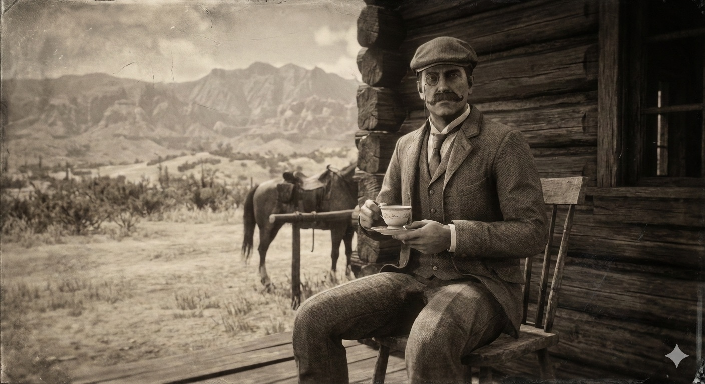

<figure><figcaption>AI-generated image of a British aristocrat in the American Wild West</figcaption></figure>

Recently, I was playing one of my all-time favorite video games, [Red Dead Redemption II](https://blog.alexseifert.com/2025/04/05/my-digital-retreat-red-dead-redemption-ii/), and ran into one of the more eccentric characters in the side mission, “[He’s British, Of Course](https://reddead.fandom.com/wiki/He%27s_British,_of_Course)“. As the name implies, he is British and speakers with a rather posh accent. While I don’t know if he was actually an aristocrat, it still got me wondering about whether the British aristocracy actually ever visited the American Wild West. It turns out, they not only visited it, but partially help to shape it.

Every so often history hands us a story that feels like it escaped from a novel — the kind of tale you assume must be exaggerated until you realize, no, people really were this eccentric. British aristocrats in the American Wild West are a perfect example. It’s one thing to imagine a duke strolling through his rose garden; it’s quite another to picture him clinging to a half‑broke mustang while trying to maintain the dignity of someone who once attended a royal garden party.

And yet, they came — monocles, waistcoats, and a heroic amount of misplaced confidence.

The West: A Convenient Place to Disappear for a While
-----------------------------------------------------

Victorian Britain was a masterpiece of social rigidity. If you were the eldest son, you inherited the estate. If you were the second son, you joined the clergy. If you were the third son, you were decorative, occasionally useful for standing in group portraits. The American West, by contrast, offered something Britain couldn’t: anonymity.

This was especially appealing to younger aristocrats who had:

-   Debts (a common aristocratic hobby)
-   Scandals (another common hobby)
-   A desire to avoid both debts and scandals

One of the most famous examples was Lord Randolph Churchill, father of Winston, who toured the American West in 1873. He wasn’t fleeing anything dramatic; he was simply curious. But his letters home describe the frontier with a mixture of fascination and mild horror, noting that American hospitality was generous but the coffee was “a crime against the palate.”

Culture Shock, Served with Dust and Questionable Coffee
-------------------------------------------------------

The West had its own ideas about fashion, most of which involved durability and the ability to survive being dragged through sagebrush. British aristocrats, however, arrived dressed for a fox hunt in Gloucestershire.

This led to scenes such as:

-   A viscount attempting to lasso cattle while wearing gloves better suited for an opera.
-   A baronet discovering that a monocle is not ideal eyewear in a sandstorm.
-   Several noblemen learning that boots polished to a mirror shine become dangerously slippery around horses.

Cowboys, to their credit, were often polite about the whole thing. One ranch hand in Wyoming reportedly described a visiting Englishman as “a decent fellow, but his hat looked like it was afraid of the sun.”

Historical Figures Who Actually Tried This
------------------------------------------

There are quite a few British aristocrats that visited or settled in the American Wild West, but the following three were some of my favorite examples of how they struggled to adapt to the reality of the American West.

### The Earl of Dunraven — The Aristocrat Who Wanted His Own National Park

Windham Thomas Wyndham‑Quin, the 4th Earl of Dunraven, visited Colorado in the 1870s and fell so deeply in love with the Rocky Mountains that he attempted to acquire tens of thousands of acres around Estes Park for a private hunting preserve. Locals were… not thrilled. His land‑grab efforts sparked lawsuits, fistfights, and a level of community outrage usually reserved for someone trying to outlaw beer.

His legacy survives in the form of the Dunraven Inn and a long list of irritated newspaper editorials from the era.

### Sir St. George Gore — The Aristocrat Who Took “Hunting Trip” Too Literally

Sir St. George Gore, an Irish baronet, embarked on a three‑year hunting expedition across the American West in the 1850s. He traveled with:

-   40 servants
-   112 horses
-   20 wagons
-   A personal brass band (because of course he did)

He reportedly killed thousands of buffalo, elk, and deer — so many that even hardened mountain men were appalled. Jim Bridger, the legendary frontiersman who guided him, later described Gore as “a man who liked shooting more than sense.”

### The Marquis of Queensberry — Yes, *That* Queensberry

John Sholto Douglas, the 9th Marquis of Queensberry (of boxing‑rules fame), spent time in the American West in the 1860s. He tried ranching, hunting, and generally behaving like a Victorian action hero. His letters home describe the West as “a place where a man may be shot for snoring too loudly,” which, depending on the saloon, was not entirely inaccurate.

Learning the Ropes (and Occasionally Getting Tangled in Them)
-------------------------------------------------------------

Despite the culture shock, many aristocrats adapted surprisingly well. Some became competent riders. Others learned to shoot without endangering everyone within a 200‑meter radius. A few even earned genuine respect.

One Englishman, Frederick Russell Burnham, went west as a teenager and became a legendary scout — so skilled that he later trained the British Army in reconnaissance. He’s one of the few aristocratic‑adjacent figures who didn’t merely survive the West but mastered it.

Still, for every Burnham, there were several noblemen who discovered that cows do not respond to polite requests, and that horses have no respect for titles.

Tea Time on the Frontier
------------------------

Some habits, however, refused to die. There are accounts of aristocrats insisting on:

-   Afternoon tea during cattle drives
-   Linen tablecloths in mining camps
-   Reading Dickens aloud in saloons
-   Wearing cravats while cleaning rifles

One Montana newspaper reported that a visiting Englishman attempted to introduce croquet to a frontier town. The game lasted ten minutes before a goat ate one of the wickets.

Conclusion
----------

Today, these stories sit somewhere between history and comedy. They remind us that the West wasn’t just a place of outlaws and opportunity, it was also a stage for some of the most unexpected reinventions imaginable.

And maybe that’s why this odd chapter of history feels so compelling. It’s not really about aristocrats or cowboys. It’s about what happens when people step outside the roles they’ve been assigned and try on a new identity, even if that identity involves chasing buffalo across the prairie while wearing a waistcoat.

Sometimes reinvention works. Sometimes it ends with a monocle lost in the desert. Either way, it makes for a much better story than staying home.