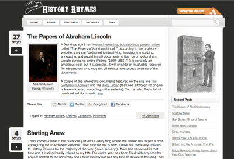

After an extended absence from my other blog, [History Rhymes](https://www.historyrhymes.info), I figured one of the best ways of showing my comeback was to find a new theme for it. Like this blog, History Rhymes is powered by WordPress which means the quickest and most convenient way to redesign the website is simply to find a new theme. This may sound easy, but is actually much more difficult in practice. Finding the right theme is extremely difficult. The theme I use now is called Lightword and looks really quite nice in my opinion:

History Rhymes, November 2012

The problem with it is that it does not really fit with the content of the blog. Since the blog is about history with a primary focus on the old American West, I have been searching for something which fits a blog with that sort of content. Old western towns are one of my biggest fascinations, so I am hoping to try to recreate the atmosphere of one of those old town as closely as possible. That means lots of wood, canvas and dust.

Unfortunately, I have not had much success as there are not many WordPress themes that meet these criteria. There are several “wooden” themes I have found which are quite nice, but none of them really fits what I am looking for. To that extent, it seems as though I am going to have to design my own theme. I’ve done this before and it can really be a tedious task. I will post my progress though as it comes along and hopefully I will have the new design up and running soon!