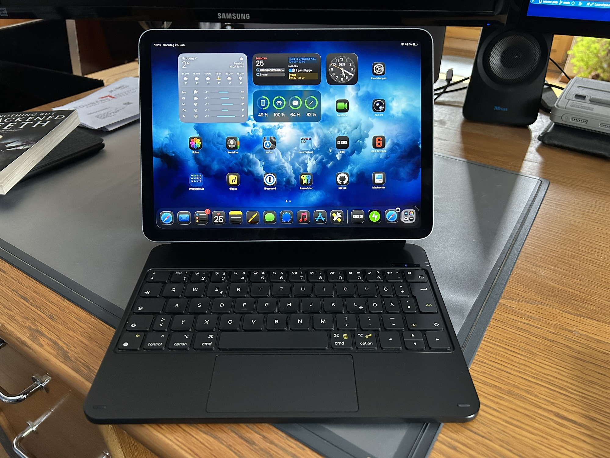
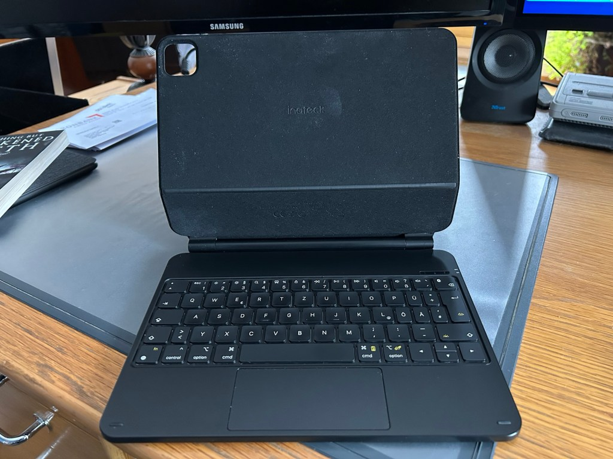
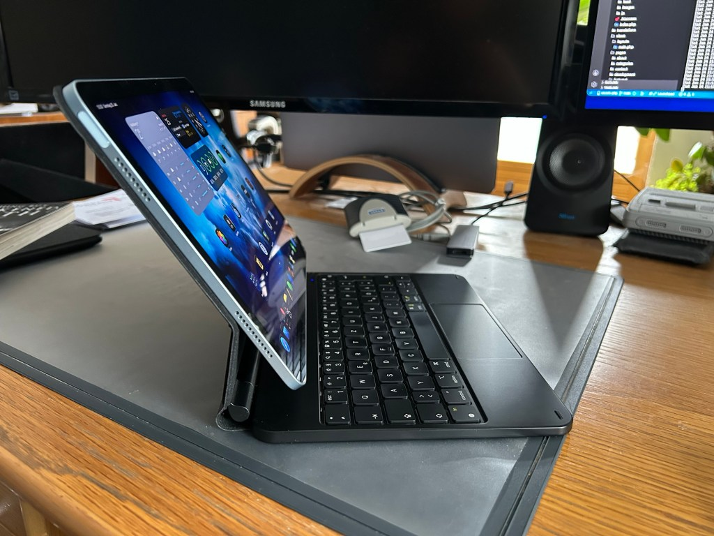

<figure><figcaption>My iPad Air attached to a keyboard</figcaption></figure>

For the past several months, I’ve been toying with the idea of replacing my 2019 Intel MacBook Pro with a desktop Mac: either a Mac Mini or Mac Studio. However, I would still want the ability to work on my writing projects on the train or from a cafe. Since I already have an M2 iPad Air, I figured I could just use that as my mobile workstation.

Since I was a little skeptical of whether an iPad could replace a laptop for everything I need it for, I decided to just give it a shot before committing by buying a desktop. It turns out, I was skeptical for a reason and remain so. This is my experience with it.

Finding a Keyboard
------------------

Apple offers the perfect keyboard and mouse combination for the iPad in the form of the Magic Keyboard. It is portable, foldable and made specifically for iPad. However, it also costs over €300 which was signficantly more than I was willing to spend for an experiment.

As such, I hopped on Amazon and found a similar product from Inateck for about €80. Obviously, for that price, the quality isn’t going to be comparable to Apple’s much more expensive version, but I figured it would still let me get a feel for how well I can use the iPad for writing while traveling. Surprisingly, the quality was still pretty good for the price point. I don’t regret the purchase at all.

This is what I bought:

<figure><figcaption>The keyboard for my iPad Air</figcaption></figure>

As you’ll notice, the keys on the right are a bit compact which makes typing on it a little difficult, but there isn’t much you can do about that considering the size of my iPad (I have the 11″ version). The keyboard itself is backlit and you can choose a variety of different light colors which is a neat gimmick. It connects to the iPad via Bluetooth and needs to be charged separately using a built-in USB-C port.

The iPad connects to the back magnetically with enough strength that I never had to worry about the iPad falling off. While they iPad is connected, you can fold it shut just like a laptop, although it is quite thick if you’re used to just having the iPad by itself. Unfortunately, they keyboard doesn’t fold around to the back of the iPad which means you have to remove the iPad if you want to use it in portrait mode. This is the furthest angle it is capable of:

<figure><figcaption>My iPad Air attached to a keyboard</figcaption></figure>

Otherwise, I don’t have many complaints about the quality of the keyboard, especially for that price. The trackpad isn’t great at all, but I found that didn’t bother me because I hardly used it. Instead, I just used the iPad’s touchscreen. I would love to see if Apple’s Magic Keyboard solves these issues, but, alas, I haven’t had the opportunity to try one out. At the very least, it appears significantly thinner in the marketing photos on Apple’s website.

Taking It Out and Using It
--------------------------

Last week, I took the train down to Regensburg for a couple of hours in the morning. I had a few things to get done and I figured that would be the perfect opportunity to try out the whole setup. I packed my iPad and the keyboard and, leaving my MacBook at home, I caught the train down.

After finding a seat, I pulled it out, set it up on my lap and started working on my post about [my experiences with the latest version of Apple’s operating systems](https://blog.alexseifert.com/2026/01/23/macos-26-tahoe-ios-26-and-ipados-26-ouch/). The first thing I realized is that the balance is off. The iPad weighs significantly more than the keyboard base which meant that the entire setup had a tendency to tip over backwards if I didn’t pay attention. That was uncomfortable which typing on my lap a bit of chore.

That was much less of an issue once I arrived in Regensburg and went into a cafe after running my errands. However, the issue that did remain was the size of the keyboard. I mentioned above that the keys on the right are not full-size due to the keyboard needing to fit the size of the 11″ iPad itself. If I had a 13″ iPad, this may not be as much of an issue. Even Apple’s expensive keyboards have this contraint.

The smaller key-size made the typing experience less pleasant and since that was what I primarily purchased it for, that was a bit of a bummer. I didn’t realize how much those smaller keys would bother me until I kept overshooting them with my pinky finger. Muscle memory is strong.

A separate, full-size Bluetooth keyboard without a number pad would be the answer to that. Combine it with a small Bluetooth mouse and the existing cover I have that allows me to prop the iPad up and it could be a viable replacement. However, you couldn’t use that setup on your lap which means using it on the train or even the couch would be a problem — both of which I do quite a bit with my MacBook.

Conclusion
----------

Overall, I wouldn’t choose to necessarily repeat the experience. The small keyboard, the awkward balancing and the software limitations of the iPad (such as not being able to program anything on it) all made for a rather unpleasant and restrictive experience.

The benefit is, of course, portability. It’s smaller and lighter than a MacBook, although the keyboard with its own separate battery is surprisingly heavy. I suspect a MacBook Air may weigh less than the combined weight of the iPad Air and the keyboard. Plus, the MacBook Air is probably thinner than both combined. However, if you already have your iPad with you anyway — something I frequently do, then just adding the keyboard is definitely lighter and less bulky than a MacBook + iPad combination.

It would be interesting to try it with a Magic Keyboard from Apple, but that probably wouldn’t fundamentally change the experience. It might be a little lighter and thinner, but the small keys would remain and I suspect the balance issue would as well. It may even be worse since the bottom portion of the Magic Keyboard appears to be much thinner and lighter than the keyboard I bought.

In all, I think I’m going to splurge and get another MacBook Pro after all. I figured I could save a few euros by buying a desktop instead, but after that experience, I think spending the extra money will be worth it. I still love my iPad and use it all the time, but I don’t think I will be using it as a replacemet for a proper computer any time soon.