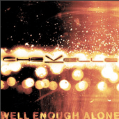

Chevelle has announcd a release date for its new album, **Vena Sera**. It will be released on April 3, 2007. The tracklisting is going to be as follows:

“Anitsait”  
“Brainiac”  
“Saferwaters”  
“Well Enough Alone”  
“Straight Jacket Fasion”  
“The Fad”  
“Humanoid”  
“Pain the Seconds”  
“Midnight to Midnight”  
“I Get It”  
“Saturdays”

You can listen to the single, “Well Enough Alone”, on Chevelle’s [Offical Website](http://www.chevelleinc.com) or on their [MySpace Page](http://www.myspace.com/chevelle) for free.

*Source: Chevelle’s [Offical Website](http://www.chevelleinc.com)*