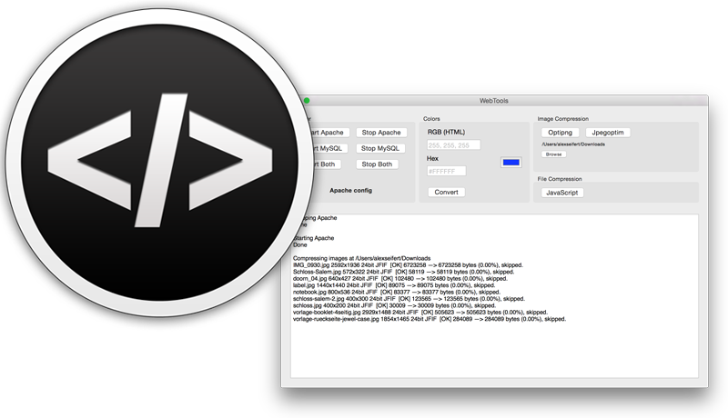

WebTools

As a developer, I tend to create a lot of my own tools when I notice that I could work more efficiently if I had a specific tool that doesn’t quite exist. That is how my new very tiny Mac app, WebTools, was brought to life. Since I am primarily a web developer, I frequently use Apache and MySQL in a local setup and was tired of always starting and stopping them on the command line. I therefore built myself a tool that will allow me to do this. Then I realized there are a few more tasks that I could easily automate with this program and WebTools was born.

Other than managing Apache and MySQL, WebTools can also convert RGB colors to their hex values and vice-verse. I’ve also built in the PNG compression tool optipng and the JPEG compression tool jpegoptim as well as Google’s Closure Compiler for minifying JavaScript files (Java is required on the system though and JAVA\_HOME must be defined in order to use it). I also created a button that will open a new terminal tab (or window) to /etc/apache2 which is where all of the Apache config files are kept. Most of these shortcuts are not only available in the app itself, but also in a menu that is added in the menubar at the top of the screen near the clock.

All in all, it’s a tiny app and really doesn’t do much other than make life easier for me, but I will continue to add features to it as I need them. Since I thought there may be a few other developers out there interested in it, [I’ve uploaded the whole thing onto GitHub](https://github.com/eiskalteschatten/WebTools) for anyone else who is interested in taking a look at it. A pre-compiled binary that’s ready to use can be downloaded [here](https://github.com/eiskalteschatten/WebTools/releases).