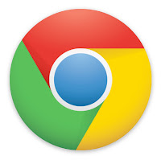

I hear an awful lot about how much people love using Google’s browser, Chrome. I have many friends and fellow web developers who swear by it, but honestly I can’t understand why. Recently I gave it a fair shot. I downloaded it for my MacBook running Mac OS X Lion and used it as my primary browser for about two weeks. After that time I couldn’t wait to go back to another browser.

Why is that? Well, there are a number of things I took issue with, but before I get into those, I will talk about my Chrome setup. I’ve talked with a few of my developer friends about some of the problems I’ve had and they’ve all told me I should reset Chrome’s preferences and disable all of my extensions, then try again. That is usually sound advice except that I had a fresh copy of Chrome installed on my computer without any extensions and I hadn’t changed any of the preferences at all.

Now to get into the problems I had. Firstly, Chrome refuses to load this blog. It simply refuses — and that despite it being a blog hosted by Google! It just sits there and loads without end with the loading circle on the tab spinning around and around forever. Eventually the separate process created by Chrome for that particular tab starts eating CPU power until it reaches about 95%. Whilst Chrome does that, I can simply switch to Safari or Firefox on the same computer at the same time and the blog will load right up without a problem. I’ve had this issue with Chrome with a few other sites as well and there doesn’t seem to be a sensible reason for it.

Secondly, the tab issue. I have to admit that I am appalled at Google’s oversight with this issue. I am one of those people who, when they browse the internet, have many, many tabs open at once. I’ve been known to have up to 30 tabs open at one time. Chrome is not in any way prepared to handle that. The tabs get infinitely smaller until the favicons and the titles disappear and you can’t distinguish between one or the other. Eventually, they reach a point where they won’t get any smaller and they just run off the side of the window. How has Google managed to not have some way to handle excessive amounts of tabs?!?! This just seems like an absolutely unnecessary and lazy oversight!

Thirdly, it feels slower when rendering a page or executing complex JavaScript applications. Of course the numbers from the Benchmark tests would have you believe otherwise, but the main point here is that it *feels* slower. Firefox for Mac is not exactly known for its speed, but even it feels faster in this department. By far the best performer on the Mac though is Safari. Although Chrome uses the webkit rendering engine (the same Safari uses), Google has built its own JavaScript engine into Chrome called V8. It seems, however, that V8 is actually based off of an old version of Safari’s JavaScript engine because websites that I visit frequently often behaved in Chrome like they did in older versions of Safari when it came to complex JavaScript functionality. Not only did it feel slower in Chrome, but some things just simply did not work at all! And this despite Google always touting its ‘advanced’ V8 JavaScript engine!

Finally, these technical reasons don’t even take into consideration some of the other, more moral issues I have with the browser. Google Chrome is the only major browser which does not have a “Do Not Track Feature” and it seems as though Google is going to keep it this way since that would run counter to their business model of making revenue from advertising. Google will, by default, also log most of the what you type into Chrome’s Omnibox (their moniker for their address bar) regardless of whether you are just searching or typing in URL. Given you can disable this in the preferences, but most users will not know to do this.

If you dislike Chrome so much, what do you use and why? Well, there really isn’t a straight-forward answer to that. As most web developers do, I use a combination of browsers. For my primary browsing, I use Apple’s Safari which is best integrated into Mac OS X. It feels like it’s by far the snappiest browser on the Mac and it also uses a lot of the built-in features of OS X such as the system-wide spellchecker, the Services menu, and built-in dictionary to define words when you right-click on them. For development purposes, I primarily use Firefox. That is because it is a cross-platform browser that is widely used and I can account for quirks that may arise in it. The developer tools are also far superior to Safari’s (Chrome’s are exactly the same as Safari’s). Until now I’ve always used several extensions for Firefox such as Firebug, Web Developer, Selenium, ColorZilla, Awesome screenshot, User Agent Switcher, etc. With version 10, Mozilla released their own built-in developer tools which I am in the process of testing out, but should those prove to be inferior to Firebug, I will simply go back to using Firebug instead.

Now that I’ve carried on about how much I dislike Chrome, I do have to admit that there are a couple of things I really do like about it. Google did a really great job designing the interface (other than the tab problem) so that it looks nice, clean, and easy to use. I like the ability to sync through my Google account. Firefox and Safari both have the ability to sync as well, but they only sync bookmarks, whereas Chrome will sync bookmarks, extensions, preferences, etc. That I find very nice. The last thing I found so great about it was how easy it was to uninstall. After all of the headaches it caused, I couldn’t wait to uninstall it and remove it from my computer entirely. Not a very good impression I have to admit.

I’ve discussed some of these issues with my friends — both web developers and non-technical people — and I am not alone in dealing with some of these issues. The non-technical people seem to have no idea and be perfectly happy with it (like most who are happy with Internet Explorer, but we won’t get into that), but most web developers I know also have their issues with Chrome that make it almost unusable. What have your experiences been? Have you had any problems with it?