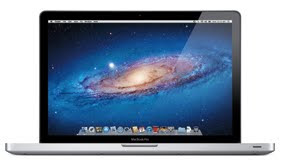

When I tell most people that I use a Mac as a developer they have an odd reaction. They look at Macs as being more like a toy computer rather than a machine which can get any actual work done. That is especially true when it comes to development of any sort. This is, however, an old notion that seems to be long in dying.

The reasons I use a Mac are not because I am one of Apple’s “fanboys” as most people who use Macs conscientiously are assumed to be. I use one for very pragmatic reasons. The first is that I *really* dislike Windows. It is a terrible operating system which has many problems which require constant solving and I simply don’t have time for that. On top of its problems, it lacks one of the key features I use everyday: a Unix terminal. Yes, there are many programs out there which will turn the Windows command prompt into a Unix-like terminal, but I’ve found those are generally not as reliable or as quick as a native terminal.

Now is the point where fans of Linux will ask why I don’t use Linux. I have used Linux and I used to use it before I bought a Mac. If Apple were to suddenly go out of business and Macs ceased to exist, I would go back to Linux before Windows. But why don’t I use Linux now? The reasons are simple. Like Windows, Linux requires constant upkeep. Unlike Windows, Linux requires far more manual maintenance. If there is a program I want to install and it requires certain libraries which I don’t have installed, I have to go out and find them and install them before I can install the program I originally wanted to install. Again, I simply don’t have time for that. Of course this manual maintenance is also one of Linux’s key strengths. It is a ridiculously flexible operating system which can be customized for any use. I am not interesting in doing that as a web developer, however. Then there are drivers. A plethora of open source drivers for all sorts of hardware exist for Linux and you are very likely to find drivers for what you need. The problem is that a large number of them are buggy and not nearly as stable as proprietary drivers which come with other OSes. Linux is an amazing client for many devices such as servers (I use Debian) which do not have peripherals or whose hardware is not likely to change any time soon, but I just do not care for it on my own computer as it simply requires too much of my time to maintain.

So why, then, do I use a Mac? There are several reasons. Firstly, it has a native terminal because OS X is built on a Unix foundation. Secondly, it works with the hardware it comes with seamlessly which allows me to focus on my work and not on maintaining my computer so that I can work. This makes for a very stable environment which does not require much maintenance. Of course there are detriments to owning a Mac. One of the more obvious ones is that Apple likes to control everything. In reality, however, this doesn’t bother me in the least. It doesn’t hamper anything I wish to do on my computer and it can even be somewhat nice in that I don’t have to worry thing I would have to on other platforms. One example would be buying an app from the Mac App Store. I don’t have to worry about malware or problems; I can simply get an app that will do what I need without concern for my computer. As a web developer, my needs are relatively few and the Mac fulfills them better than any other platform I’ve tried.