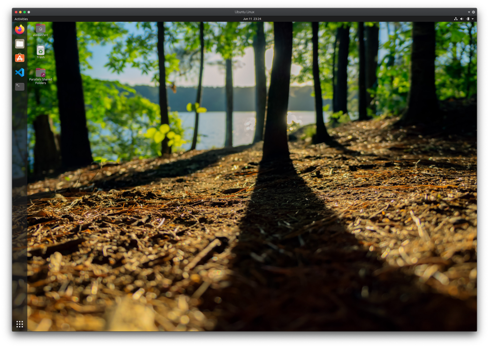

<figure><figcaption>Ubuntu 20.04 VM</figcaption></figure>

I don’t like clutter. In fact, I am very picky about what I install on my computer which is one reason I love virtual machines (VMs). They enable me to install all sorts of things to try them out and then, when I feel like the machine has become cluttered, I can just delete it and start anew without any risk of data loss.

The reason I mention that is because I like to try out new programming languages and frameworks which always involves installing new runtimes, compilers, libraries, IDEs (and/or plugins), etc. I like to experiment. Most of the time when I try one out, I end up leaving it installed for a while, but rarely use it again. That means I forget about it and eventually the unused installations fossilize and turn into layers of sediment that build up over time.

Not really, but you get the picture.

To prevent this, I use a virtual machine. Any new programming language, tools, etc I want to try first get installed in a virtual machine. The majority of the time, I use it for a short while and then stop. At some point, I will delete the VM with its fossilized runtimes and compilers and start again.

There are, of course, exceptions. If I notice I really enjoy a specific language or a particular editor, I will install it on the host machine. This is exactly the process I went through when transitioning most of my personal development from PHP, to Java, then to Node.js, then to TypeScript. These subsequently made their way from the VM onto my host machine since I use them all of the time.

The Operating Systems I Use
---------------------------

Needless to say, I use Linux in my virtual machines. It is free, there are several different flavors and it just simply works. Not to mention, other than maybe a few Microsoft technologies, most development tools, languages, etc are made to run on Linux. You can install them without a hassle and they just simply work. I’ve found this is especially important if you just want to try it out since a miserable experience getting everything to work would negatively impact your first impression.

My host machine is a late 2013 model 15″ MacBook Pro. And yes, it is that old, but I bought the top-of-the-line model at the time and still don’t feel the need to upgrade yet. It runs the latest version of macOS (as of this writing 10.15 Catalina) and has been a very robust machine that has served me extremely well over the past seven years. I will probably use it until it dies.

But back to Linux.

Not only do I like to try out new programming languages, I also like to try out new flavors of Linux. That means almost every time I install a new VM, it is not what I had before. Sometimes it is a Debian-derivative such as Ubuntu or Debian itself, other times it is a RHEL-based flavor like Fedora or CentOS, but sometimes I also feel like OpenSUSE or even Arch Linux. And even if I keep the same flavor, I almost always choose a different GUI. Sometimes Gnome, sometimes Xfce, sometimes KDE, and so on.

VMs are, of course, absolutely ideal for this. It would be a nightmare to constantly try to install new versions of Linux on bare metal — especially if you require wireless internet like I do.

What about Docker?
------------------

So you might be wondering why I don’t use Docker for these things. Docker would be perfect for trying out new programming languages because you just download and run an image which you can then cleanly and completely delete. Sounds good doesn’t?

My answer is this: yup, I could do that.

I have gathered a lot of Docker experience over the past several years both at work and for use on personal projects and I do, in fact, use it to run databases locally when developing on my MacBook since I’ve found it easier to manage them and their data that way. Plus then I don’t have creeping databases starting to take over all of my free space.

But I don’t like doing it when I try out new programming languages. Part of the reason for that is because I want the experience of setting things up. If you download a Docker image, everything already comes pre-configured and ready to use. That’s really convenient and wonderful, but I want to understand how to do that and therefore I want to get it running by configuring it myself. Once I can do it myself, I’m more than happy to use the pre-configured Docker image.

That is one reason. Another reason is that experience has shown trying to get your Dockerfile configured correctly for a new, unfamiliar language can be a bit of nightmare. Did I copy all of the right files into the image? Which files are the right files? Am I copying too much? Why is it taking so long to build the Docker image? Oh, I shouldn’t have copied the `node_modules` folder with its 280,467 files because it’s going to be overwritten anyway when I run `npm install` inside the container while building it.

For me, those are problems worth figuring out once I’ve decided I want to continue using the language. Again, it’s a lot about first impressions. If I have troubles getting everything set up — whether it’s Docker or in a VM, it doesn’t leave a good impression and there’s a high chance I will lose interest before I even get to write my first line of code.

Conclusion
----------

So what is this article actually about? Normally, that should go in the introduction, but I will put it here because I like to go against the norm.

I use virtual machines for experimenting with new technologies. This can be new programming languages, new IDEs, new Linux distros, new GUIs, etc. Essentially, it boils down to anything that I don’t use in my normal workflow, but want to experience and play with.

My normal development always takes place directly on my MacBook because a VM is usually slower and I also just simply enjoy using macOS. Since it is a BSD-flavor of Unix, it runs practically everything just as well as Linux.

There is, however, one thing I forgot to mention and that is which virtualization software I use. VirtualBox is probably your first guess since it is very commonly used, free and open-source, but I don’t use it. Instead, I use Parallels Desktop. I do pay for it and it isn’t all that cheap, but I find the VMs are significantly more responsive than in VirtualBox and its integration with the Mac is superb. It even allows me to start applications in a Linux VM directly from the macOS Dock.

I’ve found this system works well for me. I can keep my host machine clutter-free and don’t have to worry about keeping track of everything I install to experiment with. There is, of course, also the security factor of installing things in a VM instead of on my primary computer, but that is beyond the scope of this article.

In the end, it allows me to install anything I want to experiment with and have a good conscious about doing it.