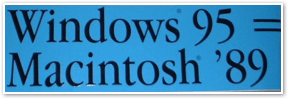

\[digg=http://www.digg.com/software/Windows\_95\_and\_Vista\]As I mentioned in another article I wrote yesterday about Windows Vista, Vista has hardly received any positive reviews. This is another example of that, however, it brings up some very good points that were not brought up in any of the other articles I posted in my last entry about Vista.

The article I read compares the launch of Windows Vista with the launch of Windows 95 over 10 years ago. When Microsoft released Windows 95 back in the third quarter of 1995, it basically provided consumers with a new interface with which to interact with their computer. It made the primary interface that users dealt with graphical by default. If you don’t know what I mean, let me explain.

Before Windows 95, PCs ran MS-DOS. MS-DOS, or sometimes simply called DOS for short, was a command-line based operating system in which the user needed to type each command in via the computer. The mouse was not used on a standard basis and in order to use commands, you had to know what they were. Then along came the graphical user interface (GUI). The GUI was first created by Xerox, then adopted by Apple for use on Apple’s Lisa computer. Microsoft eventually came out with its own version of a GUI that it called Windows. The first couple versions of Windows (Windows 1.0 and 2.0) were hardly used by consumers. After these 2 experiments, Windows 3.0 was released. Windows 3.0 was a much bigger hit with consumers than previous versions of Windows had been, however, it was not a real operating system. It was simply an application in DOS that provided the user with a graphical interface for DOS. The problem was that the user had to launch it manually. For those who were not computer savvy enough to use DOS or just didn’t care to, this wasn’t much better.

When Microsoft released Windows 95, it changed this by having the GUI launch by default. No longer did the average user have to interact with any command line interface ever again on a PC. The overall look and feel of Windows 95 was significantly different than that of the previous versions of Windows and was the forerunner of what Windows looks like today. This sounds good, right?

The problem is that none of this was innovative or even new technology. Apple had been doing this for over 10 years! Windows 95 was also clunky and buggy. How does this compare to Windows Vista today? Vista sports a cool new look and includes several new features not available in previous versions of Windows (most of which are almost directly copied from Apple’s Mac OS X Tiger), but it doesn’t include anything truly innovative.

Windows 95 was released and gained its popularity in a fledgling computer industry that was just beginning to go mainstream. Windows Vista was released in a competitive market that has high consumer expectations and a thirst for features and good looks. We’ll see how Vista holds up. Windows 95 proved to be a success despite all of its drawbacks. Maybe Vista will surprise even the most cynical of us.

By the way, I mentioned an article I read about this earlier on in this entry that inspired me to write this. You can find it [here](http://www.roughlydrafted.com/RD/RDM.Tech.Q1.07/EFDF04D6-8FE9-49E2-878C-B15FA27F1CCA.html). If you have a few minutes to kill, I recommend reading it.