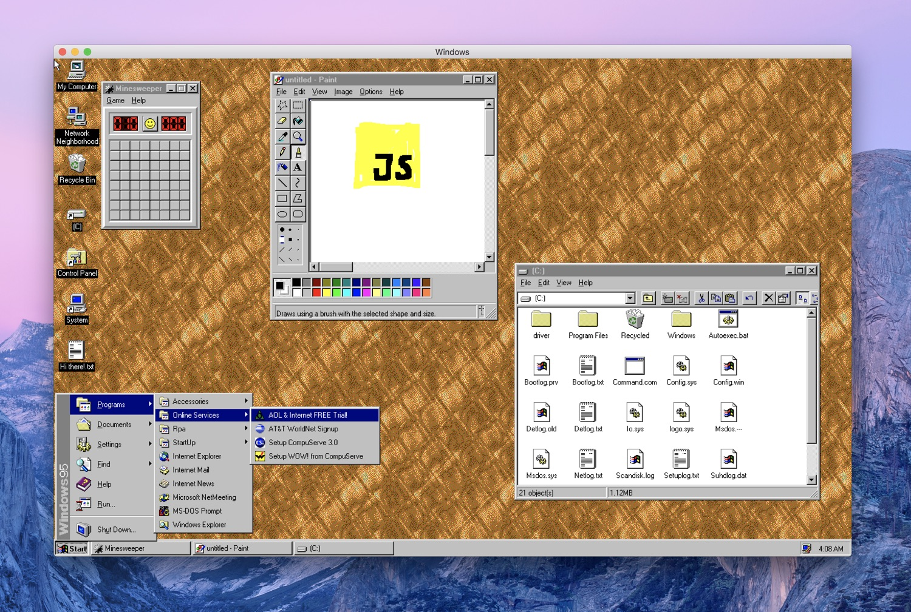
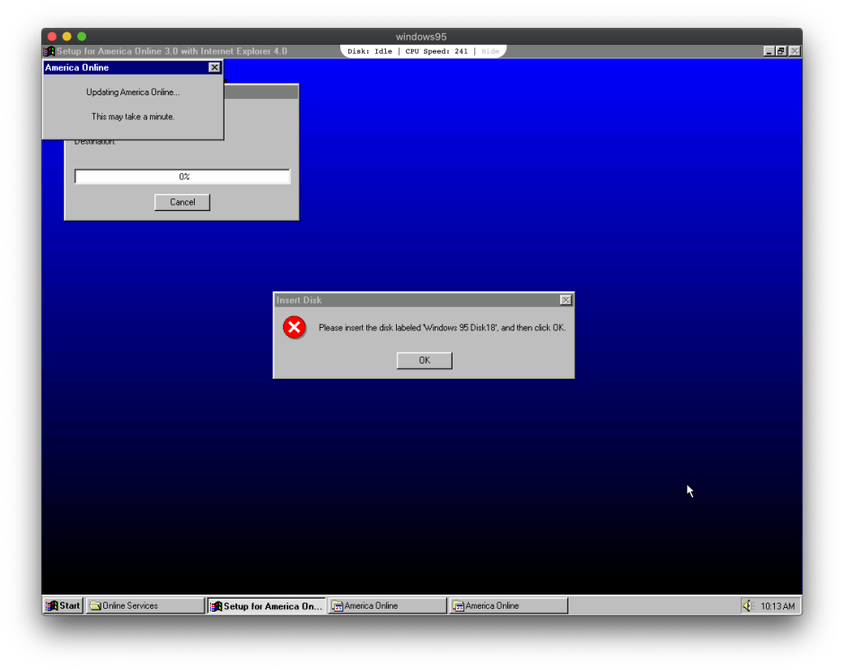

<figure><figcaption>Windows 95 running in Electron</figcaption></figure>

I know this project has been around for a while and I have run across it before, but today I decided to post about [Windows 95 running in Electron](https://github.com/felixrieseberg/windows95). Why? Because it’s possible.

This is certainly a marvel of modern technology in that an operating system that was released 25 years ago and required an entire computer to run can now instead be run in a browser window using an interpreted language like JavaScript as its underpinnings.

It doesn’t run perfectly, but it runs decently enough to perform most tasks and, I would argue, runs in many cases better than it did on some old hardware. You can even run old games with it, albeit they can be somewhat buggy.

Windows 95 Way Back When
------------------------

<figure><figcaption>The type of Gateway 2000 PC my family had</figcaption></figure>

I’m old enough to remember when Windows 95 came out. At the time, we had a family 486 PC (a Gateway 2000) running MS-DOS and Windows 3.1. We had to upgrade the RAM in order to install Windows 95. Unfortunately, I don’t remember what the exact specs of the machine were, but the RAM was definitely in the low double-digit MB range. All I specifically remember was the 200 MB hard drive that always seemed to be full.

We also added a CD-ROM which the computer didn’t originally come with in order to make installing Windows 95 easier. It was possible to purchase Windows 95 on CDs or on floppy disks. There were, however, thirteen floppy disks required to install the OS which is why we opted for the CD version.

Windows 95 on Electron
----------------------

So now comes the part we’ve all been waiting for: Windows 95 on Electron. I downloaded the application from [its GitHub repository](https://github.com/felixrieseberg/windows95) and fired it up on my MacBook running macOS Catalina (10.15).

The first time I started it, I got a blank, black screen. I had to close the window and start it again, but after that, it worked just fine.

One of the first things I noticed was that the mouse in Windows 95 did not align with the mouse in macOS. This wasn’t really a problem though once the window with Windows 95 was focused as the macOS mouse cursor disappeared.

<figure><figcaption>Windows 95 running in Electron on Alex’s MacBook</figcaption></figure>

Since I didn’t really know what to do with it, I started by changing the wallpaper to the old nerdy one that I used to use back in the day. I then popped open WordPad, typed in “Alex’s Notebook” and took the screenshot above.

After that, I saw there was an installer for America Online included. I never liked America Online, but since it was popular back then, I decided to install it to see what happens. It managed to get through most of the installation process until it needed the “Windows 95 Disk 18”:

<figure><figcaption>Windows 95 asking for “Windows 95 Disk 18” when installing America Online</figcaption></figure>

Windows used to do that a lot which was always very annoying because they weren’t exactly the disks (or CDs) that you would normally keep around in an easy-to-get-to spot. Since I don’t have any disks, I couldn’t get AOL to install.

Unfortunately, the installer killed the whole operating system and I had to close the Electron window in macOS. I tried starting it again, but the Electron app saves Windows 95’s state, meaning that when I started it again, the dead installer and OS were right back to where they were.

Fortunately, when you first start the app, it gives you the option to reset the entire system. I did this and it booted just fine, although, of course, in a “factory” state with the default wallpaper, etc.

Conclusion
----------

I didn’t really do much else with it. There are a few games installed on it such as Doom and Grand Prix, but I didn’t try those out because the app, like all virtual machines, is a battery-hog and I ran out of power on my MacBook before I got the chance.

While I didn’t end up doing much with Windows 95, it was quite fun to relive the old memories of using the operating system and to see the progress we have made since then.

It is certainly an interesting experiment and proof-of-concept. Those who liked Windows 95 or would like to use it to run certain old software will probably be well-served by the Electron app because it is convenient. Of course you could fire up a virtual machine in VirtualBox or some other virtualization software, but you would first need to get ahold of installation disks to install it. With the Electron app, that is not necessary.

If you would like to see more information about this project or try it out yourself, visit its GitHub repository at [https://github.com/felixrieseberg/windows95](https://github.com/felixrieseberg/windows95).