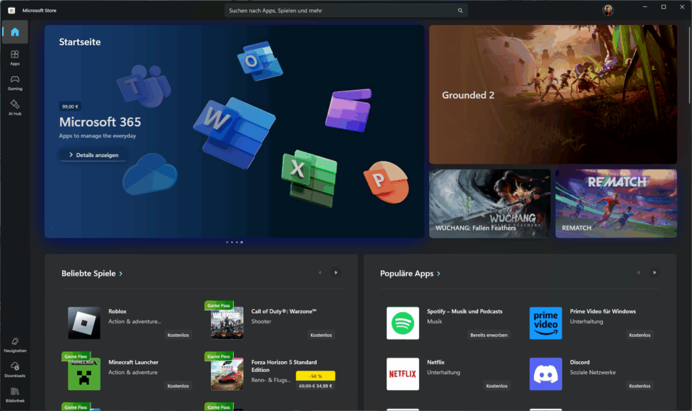

As a long-time Mac user, I find the lack of consistency in Windows’ UI utterly baffling, even in system applications from Microsoft. The latest update to Windows 11 just introduced [a new search feature in the Settings application](https://www.neowin.net/news/windows-11-gets-an-important-taskbar-update-and-more-in-the-latest-builds/) which is actually a good thing, but their choice to use an entirely different type of search bar compared to other Microsoft applications confuses me.

It is located in the center of the title bar much like the Microsoft Store, but instead of having almost square edges like every other search bar (and text box for that matter) in Windows 11’s standard design language, it has fully rounded sides like Mac OS X used to have for all of its search bars for years. Why? Just, why?

Just compare them below. Left is the Settings application and right is the Microsoft Store and File Explorer.

<figure></figure>

<figure></figure>

<figure></figure>

It might seem trivial, but details like this matter. They add up and even if most users don’t consciously notice it, they will on a subconscious level. Consistent UI makes for a smoother, easier user experience which is one major reason why macOS has such a fine reputation for user-friendliness.

I just wish Microsoft would stick to its own UI guidelines, but they won’t. Windows has a reputation for inconsistent UI even among first-party applications and it will continue happily moseying down that path. And, as my grandpa used to say, it will keep looking like the south end of a northbound donkey as it does so.