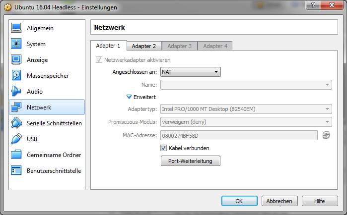
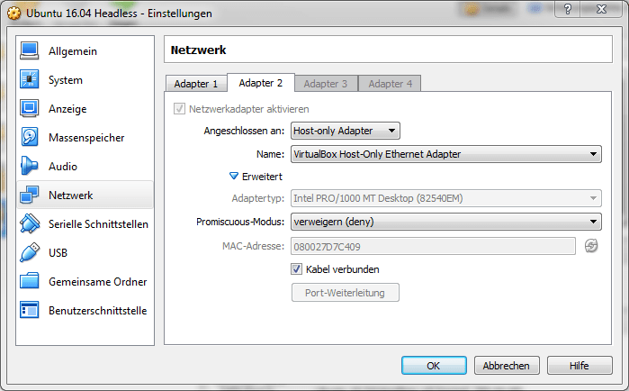
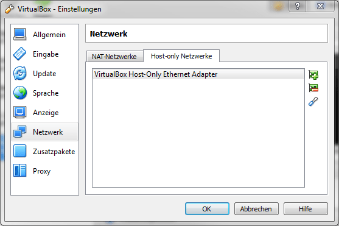
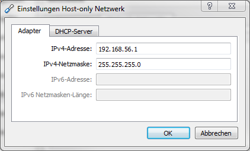
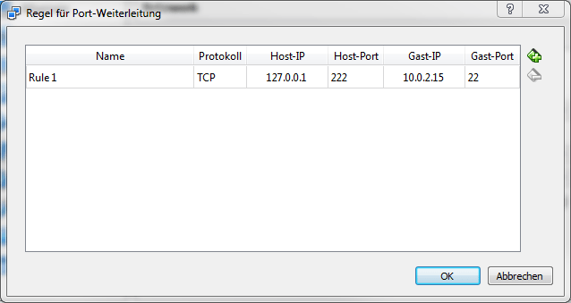

I have written before about having to work in Windows 7 with Docker which only runs natively on Linux, macOS or Windows 10. The solution I have used until now has always been to [run Xubuntu in VirtualBox](https://blog.alexseifert.com/2016/04/17/xubuntu/) and work directly with Docker inside the virtual machine. This has several advantages, but also many detriments that ended up being dealbreakers for me.

For the most part, Xubuntu runs well in VirtualBox with very little to complain about. Its performance is far better than many of the other Linux distros with weightier GUIs and since Ubuntu runs underneath the Xfce skin, it is easy to find and/or install just about any package you are looking for with dpkg and apt. Developing your application directly in VirtualBox has the advantage that you can directly interact with it and Docker without much setup. You can also easily run a web application locally and access it with a native browser with localhost.

These were the main reasons why I programmed directly in Xubuntu in VirtualBox. However, I continually ran into several annoyances that eventually forced me to find a different way to work. Xubuntu’s interface would freeze entirely from time to time which forced me to restart the virtual machine with the Alt + Ctrl + Delete command in VirtualBox. This is especially annoying if you have several terminal tabs open, your editor configured to your current needs, as well as several tasks running which then have to be restarted after the virtual machine restarts. The other irritating problem was that after an idle period of more than about ten minutes, the mouse cursor displayed on the screen no longer correlated to where the mouse actually was. That meant when I clicked a line of text in my editor, it would actually select one or two lines above or below the actual cursor. Again, the only recourse was the restart the virtual machine.

After being forced to interrupt my workflow by restarting it multiple times a day, I said enough is enough and found another solution. At first I tried another distro with another GUI (Linux Mint with MATE), but quickly ran into similar problems. The next solution I tried is the one I have stuck with for the past couple of weeks and so far, I’m happy with the results.

### Running Linux as a Server in a Virtual Machine

I decided the best way around these problems was to work natively in Windows with the source code and Docker alone in the virtual machine. This setup required two critical questions to be answered first: How would I access the source code with a native Windows editor? How would I manage the Linux virtual machine?

Both were easy to answer and surprisingly easy to setup. Since the source code would reside inside of the virtual machine, I decided the best way to access it in Windows would be to install a Samba server in Linux and mount it as a network drive in Windows. That has worked wonderfully. To manage the Linux virtual machine, I kicked around the idea of still running a minimal GUI with a terminal, but came to the conclusion that that would not solve the problems that drove me away from my original setup. Instead, I decided to access the virtual machine via SSH with a client for Windows called [MobaXterm](http://mobaxterm.mobatek.net/).

The answers to these two questions led me to a logical conclusion: I would setup a virtual machine running a GUI-less Linux distro setup as a server running on a local, computer-level network. VirtualBox has great support for setting up a local network between virtual machines and the host, so it was relatively easy to do.

Since I have had good experience with Ubuntu, I decided to install [Ubuntu Server 16.04](https://www.ubuntu.com/server) which even allowed me to install SSH and Samba during the installation process. The following instructions should work with any distro though.

### Local VirtualBox Network

The first thing to do once you’ve got your Linux distro of choice up and running is to setup the local network in VirtualBox. Please note that I have added several screenshots which are unfortunately only in German since my work PC is in German. The most important parts should be readable though even for anyone that can’t read German.

In order for the virtual machine to communicate with both the internet as well as the local network, we will have to add a network adapter to it. To do this, go to the settings for your virtual machine and click on “Network”. By default, you will see that it already has an adapter that is set to NAT:

<figure><a href="https://i0.wp.com/blog.alexseifert.com/wp-content/uploads/2016/10/VirtualBox-network-adapter-1.png?ssl=1"></a><figcaption>VirtualBox Network Adapter 1</figcaption></figure>

This adapter should be left alone as it is used to communicate with the outside world. Instead, click on the “Adapter 2” tab. Here you will need to click on the checkbox to activate the adapter, then change it to “Host-only Adapter”:

<figure><a href="https://i0.wp.com/blog.alexseifert.com/wp-content/uploads/2016/10/VirtualBox-network-adapter-2.png?ssl=1"></a><figcaption>VirtualBox Network Adapter 2</figcaption></figure>

The name of the network should automatically be chosen by VirtualBox which can just be left as it is. You can see which local networks VirtualBox has setup by going to the VirtualBox settings and clicking on “Network”, then the “Host-only Networks” tab:

<figure><a href="https://i0.wp.com/blog.alexseifert.com/wp-content/uploads/2016/10/VirtualBox-network-settings.png?ssl=1"></a><figcaption>VirtualBox Network Settings</figcaption></figure>

By selecting the network and clicking on the edit button (which looks kind of like a screwdriver), you can edit the adapter and DHCP settings:

<figure><a href="https://i0.wp.com/blog.alexseifert.com/wp-content/uploads/2016/10/VirtualBox-network-host-only-settings.png?ssl=1"></a><figcaption>VirtualBox Virtual Network Settings</figcaption></figure>

All of this will have to be done while your virtual machine is shut down. After changing these settings, we can begin setting up the virtual machine.

### SSH

The next order of business is to connect to the virtual machine via SSH. Ubuntu allowed me to setup a user as well as SSH access while installing the operating system, so I did not need to make any further configuration changes. SSH access worked out of the box. All I had to do was to find a SSH client for Windows that I liked.

At first, I tried [PuTTY](http://www.putty.org/) which is probably the best-known client for Windows, however, I found that the lack of tabs was very irritating. One of my coworkers then recommended I try [MobaXterm](http://mobaxterm.mobatek.net/) which is not only a SSH client, but also a X-Windows server that allows me to run Linux applications in Windows. There are both a free and a paid version, but I’ve found the free version works perfectly fine for my needs.

The only part that I configured was in the virtual machine settings in VirtualBox. I setup port forwarding for Network Adapter 1 so that I can access Linux without worrying about which IP address it has:

<figure><a href="https://i0.wp.com/blog.alexseifert.com/wp-content/uploads/2016/10/VirtualBox-port-forwarding.png?ssl=1"></a><figcaption>VirtualBox Port Forwarding</figcaption></figure>

Now I can start the virtual machine and access it with:

```bash
ssh username@127.0.0.1:222
```

This could also have been solved by giving Linux a static IP address and accessing it with that rather than 127.0.0.1:222.

### Getting the Virtual Machine’s IP Address

Before doing anything else, you will need to figure out your virtual machine’s IP address with the following command:

```bash
ifconfig
```

You will see at least two adapters: one with the IP address 10.0.2.15 and one with an IP address similar to 192.168.56.\*. The former is for the network adapter that allows Linux to access the internet and the latter is the IP address you are interested in. It is your virtual machine’s IP address within the local network and will allow the host (Windows) to communicate with it.

### Samba

In order to access my source code in the virtual machine with Windows, I setup Samba. It was pretty straightforward to setup and I had it running within minutes. As I mentioned before, I installed it during Ubuntu’s installation, so you might need to install it separately depending on the Linux distro you have decided to use.

The first thing I did was create a folder in my user’s home directory which I simply called “windows”. I then changed the Samba confiuration at /etc/samba/smb.conf to:

```
[global]
workgroup = smb
share modes = yes
security = user
map to guest = Bad User

[WINDOWS]
path = /home/username/windows
browseable = yes
read only = no
writable = yes
comment = smb share
printable = no
guest ok = yes
force user = username
force group = username
create mode = 0644
directory mode = 0755
```

You will probably need to use sudo to change the Samba configuration if you are not running the virtual machine as root. I then reset the Samba server with:

```bash
sudo service smbd restart
```

That’s all I needed to configure in Linux. The last part was to add the network drive to Windows. You can do that by going to “Computer” in the start menu, then click on “Map network drive” at the top. Select an available drive letter, then enter the following replacing the IP address with the one you found in the last section:

```
\\192.168.56.*\WINDOWS
```

In this case “WINDOWS” is the same as the \[WINDOWS\] section in the Samba configuration file. Now you should be able to access any files you put into the ~/windows folder in your virtual machine from Windows. This is where I put all of my source code and so I just open this folder in my Windows editor after starting my virtual machine and have direct access to everything I need.

### Accessing a Web Application from the Host

The last piece to the puzzle is accessing a web application that is running locally in the virtual machine. This is a very easy hurdle to overcome as it is actually already solved. Just start your web application or your Docker container in Linux, then enter your virtual machine’s IP address in your browser of choice in Windows. If the web application is running on a port other than 80, enter the port as well. That’s it. Now you will be able to access your web application running in a Docker container within a virtual machine on Windows.

### Conclusion

Since I have been using this setup, I have found myself to be far more productive than when working directly in the virtual machine. I no longer lose my development setup every couple of hours due to a frozen or broken GUI and nor do I have to wait for the virtual machine to restart all the time. There is also the added bonus that all of my development tools run much more quickly on a natively installed operating system.

I am happy with the new setup, but I have not been using it for all that long. Only time will tell if it fulfills all of my expectations. The real problem is, of course, having to use Windows 7 with technology that does not support it. But that is a different problem altogether.