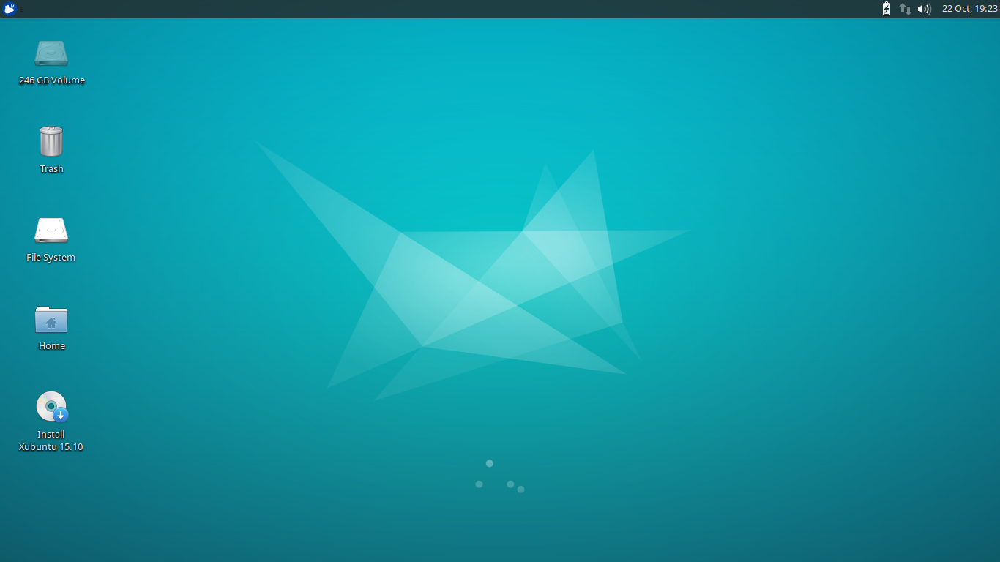

Xubuntu 15.10 *Wily Werewolf*

I’ve recently been experimenting with various flavors of Linux partially out of curiosity, partially to improve my ability to use the OS, and partially because I am forced to use Windows at work and would rather use Linux in a virtual machine. The further I delve into the world of Linux, the more I realize that everyone has their favorite distro and that they will defend these distros to the death. I am not in any position yet to defend my favorite distro to that extent yet, but I am certainly willing to discuss what I like about it and why.

Like a lot of Linux users, I am a big fan of Debian-based distributions. I use Debian on my server due to its stability and reliability, but when it comes to the desktop, I prefer Ubuntu. While a lot of Linux users do not like the controversial Unity desktop, I find it quite comfortable to work with. It does not, however, work well in Oracle’s VirtualBox which is what I find it necessary to use on my Windows computer at work. Unity is simply too resource-intensive in terms of graphics.

Several online tutorials and forums suggest that the workaround for this is to enable hardware acceleration. That may work, but hardware acceleration is disabled on my work-issued, IT-managed Windows machine, so this is not an option for me. I had to find an alternative.

Since I was keen on staying within the Ubuntu world, the first batch of alternatives I looked to were other flavors of Ubuntu. I tried a number of them: Kubuntu, Xubuntu, Lubuntu, etc. They all ran quite well in VirtualBox and would have all fulfilled my needs except for a couple of critical flaws. Kubuntu, for example, is based on KDE. It worked surprisingly well, but is still relatively resource-intensive and was therefore sometimes a bit laggy. Lubuntu features LXDE which is very lightweight and incredibly fast. It is, however, fairly ugly in my opinion and was not something I particularly enjoyed using. The one variation that was lightening fast in VirtualBox and yet not terribly ugly was [Xubuntu](http://xubuntu.org).

Xubuntu uses the Xfce desktop environment which is nearly as lightweight as LXDE, but feels much more finished. Admittedly, Xfce also has some rough edges and does not leave the impression of being as mature as Gnome or KDE, but it is well on its way to being there and is far enough along to be able to comfortably use every day.

After having worked with Xubuntu for the past month, I am very satisfied with it. I use it everyday in a dual screen setup in VirtualBox and have yet to have a problem with it. Not only is it fast and extremely stable, but being a variation of Ubuntu and thus a derivative of Debian, it supports the popular .deb package format which makes installing applications very comfortable. Since I am using the LTS version (14.04), I will receive updates for it until 2019, meaning I will not have to worry about having much down time upgrading the system because it is has been abandoned for the latest and greatest.

I can only recommend that anyone looking for a lightweight Linux distro that is easy to use, looks great and is incredibly snappy give Xubuntu a try. It can be downloaded for free at [http://xubuntu.org](http://xubuntu.org).